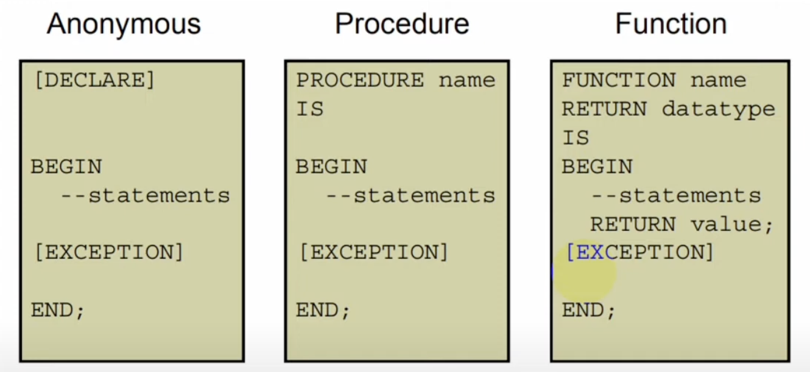

## ORACLE PL/SQL

#### Topics
* Introduction to PL/SQL
* PL/SQL Variables
* Manipulate Data
* IF Statement
* CASE Statement
* LOOP Statement
* Composite Data Types
* Cursors
* Exceptions
* Procedures
* Functions
* Packages
* Using Dynamic SQL
* Triggers
* Managing Dependencies


#### Introduction to PL/SQL

##### Benefits of PL/SQL
* Integration of procedural constructs with SQL:
The most important advantage of PL/SQL is the integration of procedural constructs with SQL. SQL is a nonprocedural language.
* Improved performance:
Without PL/SQL, you would not be able to logically combine SQL statements as one unit.

##### PL/SQL Block Structure
* DECLARE (optional)
    - Variables, cursors, user-defined exceptions
* BEGIN (mandatory)
    - SQL statements - PL/SQL statements
* EXCEPTION (optional)
    - Actions to perform when exceptions occur
* END; (mandatory)

##### Three types of blocks that make up a PL/SQL program



* Anonymous blocks: Anonymous blocks are unnamed blocks. These blocks are not stored in the database.
* Procedures: Procedures are named objects that contain SQL and/or PL/SQL statements.
* Functions: Functions are named objects that contain SQL and/or PL/SQL statements. Unlike a procedure, a function returns a value of a specified data type.

##### Executing an Anonymous Block
```
/*The Below Line Declaration is for DBMS_OUTPUT.PUT_LINE*/
SET SERVEROUTPUT ON

DECLARE
    /* Declarative Section */
    v_fname VARCHAR2(25);
BEGIN
    /* Executable Section */
    SELECT first_name INTO v_fname
    FROM employees WHERE employee_id=200;
    DBMS_OUTPUT.PUT_LINE(' First Name is: ' || v_fname);
END;
/
```

```
SET SERVEROUTPUT ON

DECLARE
    v_myName VARCHAR2(20);
BEGIN
    DBMS_OUTPUT.PUT_LINE('My name is: ' || v_myName);
    v_myName := 'John';
    DBMS_OUTPUT.PUT_LINE('My name is: ' || v_myName);
END;
/
```

```
SET SERVEROUTPUT ON

DECLARE
    v_myName VARCHAR2(20) := 'John';
BEGIN
    v_myName := 'Doe';
    DBMS_OUTPUT.PUT_LINE('My name is: ' || v_myName);
END;
/
```

##### Multiple Variable use
```
SET SERVEROUTPUT ON

DECLARE
    V_NAME VARCHAR2(25);
    V_SALARY NUMBER(10);

BEGIN
    SELECT FIRST_NAME, SALARY
    INTO V_NAME, V_SALARY
    FROM EMPLOYEES
    WHERE EMPLOYEE_ID = 200;

    DBMS_OUTPUT.PUT_LINE('FIRST NAME IS: ' || V_NAME);
    DBMS_OUTPUT.PUT_LINE('SALARY IS: ' || V_SALARY);
END;
/
```
##### Avoid using variable names
Declare state variable name and select state variable name should not be same.
```
-- BAD PRACTICE
DECLARE
    FIRST_NAME VARCHAR2(25);
BEGIN
    SELECT FIRST_NAME
    INTO FIRST_NAME
    FROM EMPLOYEE
    WHERE EMPLOYEE_ID=200;
    DBMS_OUTPUT.PUT_LINE('FIRST NAME IS: ' || FIRST_NAME);
END;
/
```
##### %TYPE Attribute
```
DECLARE
    V_FIRST_NAME EMPLOYEES.FIRST_NAME%TYPE;
BEGIN
    SELECT FIRST_NAME
    INTO V_FIRST_NAME
    FROM EMPLOYEES
    WHERE EMPLOYEE_ID=200;
    DBMS_OUTPUT.PUT_LINE('FIRST NAME IS: ' || V_FIRST_NAME);
END;
/
```

```
DECLARE
    V_BALANCE NUMBER(7, 2);
    V_MIN_BALANCE V_BALANCE%TYPE := 1000;
BEGIN
    V_BALANCE := 15000;
    DBMS_OUTPUT.PUT_LINE(V_BALANCE);
END;
/
```
##### Double quotation mark
```
DECLARE
    V_EVENT VARCHAR2(15);
BEGIN
    V_EVENT := q'!Father's Day!';
    DBMS_OUTPUT.PUT_LINE('3rd Sunday in June is: ' || V_EVENT);
    V_EVENT := q'[Mother's Day]';
    DBMS_OUTPUT.PUT_LINE('2nd Sunday in May is: ' || V_EVENT);
END;
/
```

##### Bind Variables
ALso called host variables. Used in SQL statements and PL/SQL blocks. Values can be output using the PRINT command.

```
-- DECLARE Bind Variable
VARIABLE X NUMBER(15);
BEGIN
    :X := 100;
END;
/

-- PRINT Bind Variable value
PRINT X;
```

```
VARIABLE B_EMP_SALARY NUMBER;

BEGIN
    SELECT SALARY
    INTO :B_EMP_SALARY
    FROM EMPLOYEES
    WHERE EMPLOYEE_ID=200;
END;
/

PRINT B_EMP_SALARY
```

```
VARIABLE B_RESULT NUMBER;

BEGIN
    SELECT (SALARY*12)+NVL(COMMISSION_PCT, 0)
    INTO :B_RESULT
    FROM EMPLOYEES
    WHERE EMPLOYEE_ID=200;
END;
/

PRINT B_RESULT
```


##### Commenting the code
```
-- Single Line Comment Example
/* Multi Line
Comment
Example */
```

##### SQL Function in PL/SQL
```
CREATE OR REPLACE FUNCTION F_CALCULATION
(
    PURCHASE NUMBER,
    SELL NUMBER
)
RETURN NUMBER IS
BEGIN
    RETURN SELL-PURCHASE;
END;
/

SELECT F_CALCULATION(120, 100) FROM DUAL;
```

```
CREATE OR REPLACE FUCNTION F_jog
(
    X NUMBER,
    Y NUMBER, 
    Z NUMBER,
    A NUMBER
)
RETURN NUMBER IS
BEGIN
    RETURN X/Y-Z+A;
END;
/

SELECT F_jog(100,5,1,2) FROM DUAL;
```

```
DECLARE
    v_salary NUMBER(6):=6000;
    v_sal_hike VARCHAR2(5):='1000';
    v_total_salary number(6);

BEGIN
    v_total_salary := v_salary + v_salary_hike;
    DBMS_OUTPUT.PUT_LINE(v_total_salary);
END;
/
```

##### Boolean Variable
```
DECLARE
    V_VSAL NUMBER(10):=10000;
    good_sal BOOLEAN;
BEGIN
    good_sal := V_VSAL BETWEEN 50000 AND 150000;
    IF good_sal THEN
        DBMS_OUTPUT.PUT_LINE('YES');
    ELSE
        DBMS_OUTPUT.PUT_LINE('NO');
    END IF;
END;
/
```

##### IF Statement
```
DECLARE
    V_AGE NUMBER:=10;
BEGIN
    IF V_AGE < 11 THEN
        DBMS_OUTPUT.PUT_LINE('Child');
    ELSIF V_AGE < 20 THEN
        DBMS_OUTPUT.PUT_LINE('Young');
    ELSIF V_AGE < 30 THEN
        DBMS_OUTPUT.PUT_LINE('Twenties');
    ELSIF V_AGE < 40 THEN
        DBMS_OUTPUT.PUT_LINE('Thirties');
    ELSE
        DBMS_OUTPUT.PUT_LINE('Always Young');
    END IF;
END;
/
```


##### CASE Statement
```
DECLARE
    V_NAME VARCHAR2(25) := UPPER('&grade');
    V_APPRAISAL VARCHAR2(20);
BEGIN
    V_APPRAISAL := 
    CASE
    V_NAME
        WHEN 'AZIZ' THEN 'Excellent'
        WHEN 'FOYSAL' THEN 'Very Good'
        WHEN 'RAFIQ' THEN 'GOOD'
        ELSE 'No Such Grade'
    END;
    DBMS_OUTPUT.PUT_LINE('Name: ' || V_NAME || ' Appraisal: ' || V_APPRAISAL);
END;
/
```

```
DECLARE
    V_GRADE CHAR(1) := UPPER('&grade');
    V_APPRAISAL VARCHAR2(20);
BEGIN
    V_APPRAISAL :=
    CASE
        WHEN V_GRADE = 'A' THEN 'Excellent'
        WHEN V_GRADE IN ('B', 'C') THEN 'Good'
        ELSE 'No Such Grade'
    END;
    DBMS_OUTPUT.PUT_LINE('Grade: ' || V_GRADE || ' Appraisal: ' || V_APPRAISAL);
END;
/
```


##### Merge Statement
```
BEGIN
    MERGE INTO copy_emp c
    USING employees e
    ON (e.employee_id = c.employee_id)

    WHEN MATCHED THEN
    UPDATE SET 
    c.first_name = e.first_name,
    c.last_name = e.last_name,
    c.email = e.email

    WHEN NOT MATCHED THEN
    INSERT VALUE 
    (e.first_name, e.last_name, e.email);
END;
/
```

##### Nested blocks
```
DECLARE
    V_OUTER_VARIABLE VARCHAR2(20) := 'GLOBAL VARIABLE';
BEGIN
    DECLARE
        V_INNER_VARIABLE VARCHAR2(20) := 'LOCAL VARIABLE';
        DBMS_OUTPUT.PUT_LINE(V_INNER_VARIABLE);
        DBMS_OUTPUT.PUT_LINE(V_OUTER_VARIABLE);
    BEGIN
    DBMS_OUTPUT.PUT_LINE(V_OUTER_VARIABLE);
    END;
END;
/
```