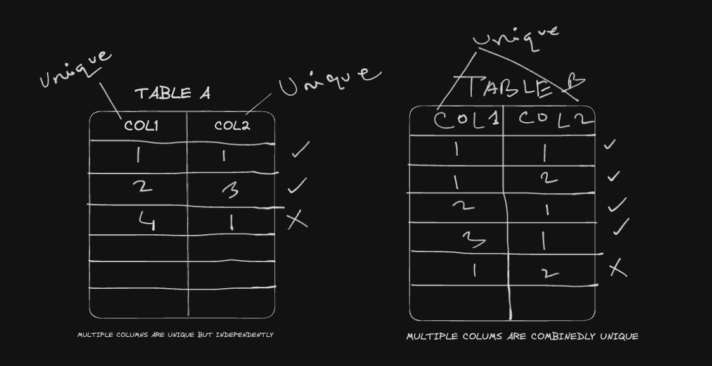
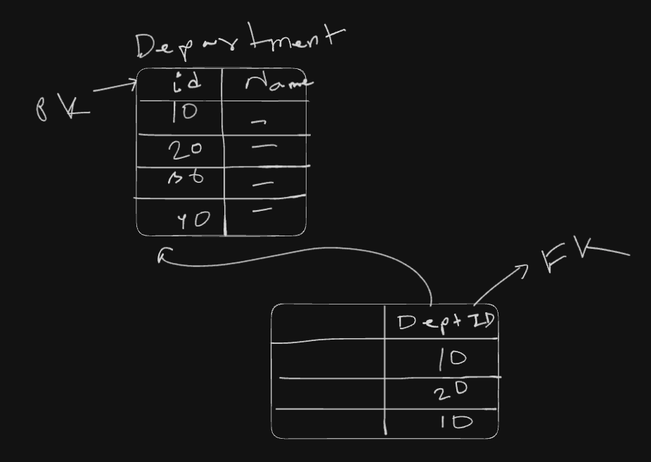

# Oracle SQL - TutorialsPoint

### What is Database?
* Provides permanent storage of data
* Is a collection of different database objects
* Different objects have different roles to perform
* Refers to a set of related data and the way it is organized

### What is DBMS?
* DBMS is a computer software application that interacts with the user, other applications to capture and analyze data
* Is designed to allow the definition, creation, querying, update and administration of databases
* Data sharing, data security, data integration, data access are some the major advantages of dbms

### What is RDBMS?
* Is a database with relational model
* Developed by E.F. Codd
* RM purpose is to provide a declarative method for specifying data queries
* Most relational database use the SQL

### SQL
* Stands for Structured Query Language
* Designed by Donald Chamberlin and Raymond Boyce in 1974
* Is a special-purpose language designed for managing data held in a RDBMS
* Is a forth generation language
* Can be classified in several types on the basis of task performed

### CLassification of SQL
* DDL - Data Definition Language
* DML - Data Manipulation Language
* DRL - Data Retrieval Language
* DCL - Data Control Language
* TCL - Transaction Control Language

### Introduction to Oracle
* Founded by Larry Ellison with Bob Miner and Ed Oates in 1977
* Deals with the Databases, Middleware, Business Apps, Development Softwares, File Systems, Operating Systems, etc.

### Environment Setup
* Download and install Orcale Database from oracle.com
* Oracle Database online compiler: https://www.programiz.com/sql/online-compiler/
* SQL Database Online Compiler: https://sqlfiddle.com/

### Getting Started
```
$ sqlplus (it is a command line tool that allows to access and interact with oracle database)
Enter user-name: sys/system
Enter Password: Password provided while installation

$ disc (Disconnect from the database)
$ conn sys as sysdba (connecting with database with sys user as sysdba)

$ show user (show the connected user)
```

### DDL (Data Definition Language) Statement
* Create (Create any database object)
* Alter (Update any database object structure)
* Drop (Delete database object)
* Truncate (To delete all the data from a table)
* Rename (Rename any particular database object)

### Create Table
* Can be classified in Data Dictionary and User Tables
* Must give a valid Table name
* User must have a create table permission and storage area
* Table will be created in user's schema
* DEFAULT keyword is used to set default value for the column

```
$ CREATE TABLE Employees(
    EmpId number,
    FirstName varchar2(20),
    LastName varchar2(20),
    EmailId varchar2(50),
    Gender char(1),
    MobileNo char(10),
    DateOfJoining date default sysdate,
    DeptId int
);
```

### Alter Table
* Adding column
* Modifying column
* Dropping column
* Renaming column

```
# Add new column in table
$ ALTER TABLE Employees add DOB date;
$ ALTER TABLE Employees add (Salary number(10,2), Col1 number);

# Change datatype of any column
$ ALTER TABLE Employees modify Col1 varchar2(10);

# Delete column
$ ALTER TABLE Employees DROP COLUMN Salary;
$ ALTER TABLE Employees SET UNUSED COLUMN Col1;
$ ALTER TABLE Employees DROP UNUSED columns;
```

### Drop Table
```
$ DROP TABLE Employees;
```

### Truncate Table
```
$ TRUNCATE TABLE Employees;
```

### Constraints
* Is a rule to which data must be conform
* Constraint names are optional
* Can be added at Column level or Table Level
* Can be enabled/disabled/dropped
* Types of Constraints: NOT NULL, UNIQUE, PRIMARY KEY, CHECK, FOREIGN KEY

### NOT NULL Constraint
```
$ CREATE TABLE Sample1(
    Col1 number constraint Sample1_Col1_nn NOT NULL,
    Col2 number NOL NULL
);
$ ALTER TABLE Employees modify FirstName varchar2(20) constraint Employee_FirstName_NN NOT NULL;
```

### UNIQUE Constraint


```
CREATE TABLE Sample2(
    Col1 NUMBER CONSTRAINT Sample2_Col1_un UNIQUE,
    Col2 NUMBER,
    Col3 NUMBER,
    CONSTRAINT Sample2_unique UNIQUE(Col2, Col3)
);
```

```
ALTER TABLE Employees ADD CONSTRAINT Employee_Email_un UNIQUE(EmailID);
```

### PRIMARY KEY Constraint
* Column Level Primary Key Constraint
```
CREATE TABLE Sample1(
    Col1 NUMBER CONSTRAINT Sample1_pk PRIMARY KEY,
    Col2 NUMBER,
    Col3 NUMBER
);
```
* TABLE Level Primary Key Constraint
```
CREATE TABLE Sample1(
    Col1 NUMBER,
    Col2 NUMBER,
    Col3 NUMBER,
    CONSTRAINT Sample1_pk PRIMARY KEY(Col1)
);
```
* ALTER TABLE
```
ALTER TABLE Sample1 ADD CONSTRAINT Sample1_pk PRIMARY KEY(Col1);
```

### CHECK CONSTRAINT
The CHECK constraint is used to limit the value range that can be placed in a column.
```
CREATE TABLE Sample1(
    Col1 NUMBER(10) CONSTRAINT Sample1_col1_check CHECK(Col1 >= 10000)
);
```
```
ALTER TABLE Employees ADD CONSTRAINT Emp_gender_check CHECK(gender in ('M', 'F'));
```

### FOREIGN KEY CONSTRAINT


```
CREATE TABLE Departments(
    DEPTID NUMBER CONSTRAINT Departments_constraint_nn NOT NULL,
    DEPTNAME VARCHAR2(20)
);

CREATE TABLE Employees(
    EmpId NUMBER(3) CONSTRAINT Employees_empid_nn NOT NUL,
    FirstName VARCHAR2(20) CONSTRAINT Employees_firstname_nn NOT NULL,
    DeptId NUMBER,
    CONSTRAINT Employees_deptid_rel FOREIGN KEY(DeptId) REFERENCES Departments(DeptId) ON DELETE SET NULL
);

CREATE TABLE Employees(
    EmpId NUMBER(3) CONSTRAINT Employees_empid_nn NOT NUL,
    FirstName VARCHAR2(20) CONSTRAINT Employees_firstname_nn NOT NULL,
    DeptId NUMBER,
    CONSTRAINT Employees_deptid_rel FOREIGN KEY(DeptId) REFERENCES Departments(DeptId) ON DELETE CASECADE
);
```

```
ALTER TABLE Employees ADD CONSTRAINT Emp_dept_Rel FOREIGN KEY(DeptId) REFERENCES Departments(DeptId) ON DELETE SET NULL;
```

### Managing Constraints
* Add a constraint
```
ALTER TABLE customers ADD CONSTRAINT unique_email UNIQUE(email);
```
* Disable a constraint
```
ALTER TABLE customers DISABLE CONSTRAINT unique_email;
```
* Enable a constraint
```
ALTER TABLE customers ENABLE CONSTRAINT unique_email;
```
* Drop a constraint
```
ALTER TABLE customers DROP CONSTRAINT unique_email;
```

### Data Manipulation Language
* Add new rows to a table
* Modify existing rows in a table
* Remove existing rows from a table
* Multiple DML statements performing a logical task is called transaction
* Use COMMIT command to save the changes
* Use ROLLBACK command to undo the changes
* Statements: Insert, Update, Delete, Merge

### Insert Statement
```
INSERT INTO Customers(customer_id, first_name, last_name, age, country) VALUES(1, "Yeasin", "Arafath", 25, "BAN");
```

```
INSERT INTO Customers VALUES(1, "Yeasin", "Arafath", 25, "BAN");
```

```
INSERT INTO Customers VALUES(&customer_id, "&first_name", "&last_name", &age, "&country");

COMMIT; -> TO commit the changes
```

### Update Statement
```
UPDATE Employees SET DeptId = 30 WHERE EmpId = 101;

UPDATE Employees SET MobileNo = '123456789', LastName = 'Dubey', DateOfJoining = '20-Dec-16' WHERE EmpId = 102;
```

### DELETE STATEMENT
```
DELETE FROM Employees WHERE EmpId = 101;
```

### Merge Statement
Merge statement in SQL is used to perform insert, update and delete operations on a target table 
based on the results of JOIN with a source table. This allows users to synchronize two tables by performing operations on one table based on results from the second table.

The merge statement compares data between a source table and a target table based on specified key fields. It performs appropriate actions like inserting new records, updating existing ones and deleting or flagging records on longer present in the source.

For example:
There are two tables, Employees Table and Copy of Employees table. Want to update data in copy employees table from employees table and if not present then insert the missing data into copy employees table.

```
MERGE INTO Copy_Employees c
using Employees e 
on (e.empid = c.empid) 
when matched then 
update set 
c.firstname = e.firstname,
c.lastname = e.lastname,
c.mobileno = e.mobileno,
c.deptid = e.deptid
when not matched then INSERT VALUES(e.firstname, e.lastname, e.mobileno, e.deptid);
```

Update any field value
```
UPDATE Employees SET deptid = 30 where empid = 101;
```

### Managing SQL Transactions
* DDL(Data Definition Language) & DCL(Data Control Language) commands are auto committed.
* DML commands need to be managed
* Transaction begins with first DML command
* Transaction ends when
    - COMMIT or ROLLBACK is issued
    - DDL or DCL command issued
    - Command editor exits
    - System crashes
* SAVEPOINTS can be placed in the transaction as a marker for rollback

```
$ INSERT INTO Departments VALUES(50, "IT");
$ COMMIT;
$ DELETE FROM Departments;
$ ROLLBACK;
$ UPDATE Departments set DeptName = "CSE" WHERE DeptId = 30;
$ SAVEPOINT updations;
$ ROLLBACK to updations;
```

### SELECT statement
* Is a DRL (Data Retrival Language)
* SELECT clause specifies the columns to search
* FROM clause specifies the data source
* Column search can be modified using expressions.

```
$ SELECT * FROM Employees;
$ SELECT Employee_Id, First_Name, Last_Name from Employees;
$ SELECT Employee_Id, First_Name || ' ' || Last_Name, Salary FROM Employees;
$ SELECT Employee_Id, First_Name || ' ' || Last_Name, Salary * 2 FROM Employees;
$ SELECT Employee_Id, First_Name || ' ' || Last_Name as Employee_Name, salary * 12 as Annual_Salary FROM Employees;
$ SELECT DISTINCT Department_Id from Employees; -> Remove the duplicate data and show only unique data
```

### Sorting Data
* ORDER BY clause sorts the data
* ORDER BY must be the last clause of the SELECT statement
* Default is ascending order sort
```
$ SELECT First_Name from Employees ORDER BY First_Name;
$ SELECT First_Name from Employees ORDER BY First_Name ASC;
$ SELECT First_Name from Employees ORDER BY First_Name DESC;
$ SELECT Employee_Id, First_Name, Last_Name, Salary FROM Employees ORDER BY Salary DESC, First_Name;
```

### Filtering Data in SQL
* WHERE clause is used to add conditions to filter
* Various operators can be used to pass the conditions
* Comparison Operators: = (equal to), != (Not equal to), > (greater than), < (less than), >= (greater than or equal to), <= (less than or equal to)
```
$ SELECT first_name FROM Employees WHERE Emp_id = 30;
$ SELECT first_name FROM Employees WHERE Emp_id != 30;
$ SELECT first_name FROM Employees WHERE salary >= 10000;
```
* Logical Operators: and, or, not operators
```
$ SELECT first_name FROM Employees WHERE salary > 10000 AND Dep_id = 20;
$ SELECT first_name FROM Employees WHERE salary > 10000 or salary < 20000;
```
* Special Operators: IN, BETWEEN ... AND, LIKE, IS NULL
```
$ SELECT first_name FROM Employees WHERE Emp_id IN (101, 104, 106);
$ SELECT first_name FROM Employee WHERE Emp_id NOT IN (102, 108, 111);
$ SELECT first_name FROM Employees WHERE salary BETWEEN 10000 AND 20000;
$ SELECT first_name FROM Employees WHERE first_name LIKE 'A%';
$ SELECT first_name FROM Employees WHERE first_name LIKE '%a';
$ SELECT first_name FROM Employees WHERE first_name LIKE 'A____';
$ SELECT first_name FROM Employees WHERE dept_id IS NULL;
$ SELECT first_name FROM Employees WHERE dept_id IS NOT NULL;
```

### Functions in SQL
* Performs some specific task
* Accepts the values through parameters
* Returns the processed data
* Types of functions: Single Row Function, Multi-row function
* Single Row Function:
    
    - Character functions
    - Number Functions
    - Date Functions
    - Conversion Functions
    - General Functions

### Character Functions
* Case Manipulation
* Character Manipulation

```
$ SELECT Employee_Id, upper(first_name), lower(last_name), salary FROM Employees WHERE lower(last_name) = "king";
$ SELECT initcap('anadi shArma') from dual;
$ SELECT Employee_Id FROM Employees WHERE length(first_name) = 5;
$ SELECT Employee_Id, concat(upper(first_name), lower(last_name)) FROM Employees;
$ SELECT first_name, substr(phone_number, 0, 3) FROM Employees;
$ SELECT first_name, rpad(substr(phone_number, 0, 3), 7, '*') FROM Employees;
```


### Number Functions
Numeric functions are used to perform operations on numbers and return numbers. Following are the numeric functions defined in SQL:
1. ABS(-243.5) -> it returns the absolute value of a number
2. ACOS(0.25) -> It returns the cosine of a number, in radians
3. ASIN(0.25) -> It returns the arc sine of a number, in radians
4. ATAN(2.5) -> it returns the arc tangent of a number, in radians
5. CEIL(25.75) / CEILING(25.75) -> It returns the smallest integer value that is greater than or equal to a number
6. COS(30) -> It returns the cosine of a number
7. COT(6) -> it returns the cotangent of a number
8. DEGREES(1.5) -> It converts a radian value into degrees
9. 10 DIV 5 -> It is used for integer division
10. EXP(1) -> It returns e raised to the power of a number
11. FLOOR(25.75) -> It returns the largest integer value that is less than or equal to a number.
12. GREATEST(30, 2, 36,81,125) -> It returns the greatest value in a list of expressions
13. LEAST(30, 2, 36, 81) -> it returns the smallest value in a list of expressions
14. MOD(18, 4) -> It returns the remained of n divided by m
15. PI() -> It returns the value of pi
16. POWER(4,2)
17. ROUND(5.33)
18. SQRT(25)
19. TRUNCATE(7.523545, 2)


### SQL Date & Time Functions
Sample of date format: '24-JAN-17'

1. '24-JAN-17' + 5 -> returns 5 months later date
2. '24-JAN-17' - 5 -> returns 5 months before date
3. '24-JAN-17' + 14/24 -> returns 14hrs later date of the date
4. to_date('31-DEC-16') - to_date('23-FEB-88') -> returns the difference between the dates in days
5. months_between('31-DEC-16', '23-FEB-88') -> returns the difference between the dates in months
6. round(months_between('31-DEC-16', '23-FEB-88')) -> returns the difference between the dates in months in rounded value
7. next_day('26-JAN-17', 'Monday') -> returns the next monday date from the provided date.
8. add_months('31-DEC-16', 15) -> returns the date after the provided months
9. round(to_date('24-AUG-17'), 'year') -> returns '01-JAN-18'


### Conversions Functions
* Varchar2 and Char implicitly converts to number or date
* Type conversions can also be done explicitly

1. to_char('25-JAN-17', 'dd-Month-yyyy') -> returns 25-January - 2017
2. to_char('25-JAN-17', 'dd-Month-yyyy day') -> returns 25-January - 2017 wednesday
3. to_char('25-JAN-17', 'day') -> returns wednesday
4. SELECT Employee_Id, First_Name, Last_Name, Department_Id, Hire_date FROM Employees WHERE lower(to_char(hire_date, 'day')) = 'wednesday';
5. to_char('25-JAN-17', 'ddsp mon yyyy') -> returns twenty-five jan 2017
6. to_char('25-JAN-17', 'ddspth mon yyyy') -> returns twenty-fifth jan 2017
7. to_char('25-JAN-17', 'HH : MI : SS') -> returns 03:36:54
8. to_char('25-JAN-17', 'HH : MI : SS AM') -> returns 03:36:54 PM
9. to_number(to_char('25-JAN-17', 'dd')) -> returns 25


### General Functions
SQL general functions are built-in functions provided by sql databases to perform a variety of operations on data. These functions are crucial for manipulating, analyzing and transforming data efficiently.
These functions are categorized into several types based on their functionality.

** Single Row Functions
1. NVL function: It converts a null value to an actual value. Data types that can be used are date, character and number. The data type must match with each other i.e. expr1 and expr2 must be the same data type.
Syntax: NVL(expr1, expr2)

```
SELECT salary, NVL(commission_pct, 0) (salary*12) + (salary*12*NVL(commission_pct, 0)) annual_salary FROM employees;
```

2. NVL2 function: It examines the first expression. If the first expression is not null, then the NVL2 function returns the second expression. If the first expression is null, then the third expression is returned.
Syntax: NVL2(expr1. expr2, expr3)

```
SELECT last_name, salary, commission_pct, NVL2(commission_pct, 'SAL+COMM', 'SAL') income FROM employees;
```

3. COALESCE function
It examines the first expression, if the first expression is not null, it returns that expression, otherwise it does a COALESCE of the remaining expression.
The advantage of the COALESCE() function over the NVL() function is that the COALESCE function can take multiple alternate values. In simple words COALESCE() function returns the first non-null expression in the list.
Syntax: COALESCE(expr1, expr2, ...., exprn);

```
SELECT last_name, COALESCE(commission_pct, salary, 10) comm FROM employees ORDER BY commission_pct;
```

4. NULLIF function
It compares two expressions, if they are equal, the function returns null. If they are not equal, the function returns the first expression.

```
SELECT LENGTH(first_name) "expr1", LENGTH(last_name) "expr2", NULLIF(LENGTH(first_name), LENGTH(last_name)) result FROM employees;
```

### SQL Joins
* Is used to get the data from multiple tables
* At least one common field must be there to create a join
* Can be classified on the basis of data retrieval

### Oracle Proprietary Joins
* Equi join: Oracle Equi Join returns the matching column values of the associated tables. It uses a comparison operator in the WHERE clause to refer equality.
Syntax:
```
SELECT * FROM table1, table2 WHERE table1.column_name = table2.column_name;
```

Equijoin also can be performed by using JOIN keyword followed by ON keyword and then specifying names of the columns along with their associated tables to check equality.\
Syntax:
```
SELECT * FROM table1 JOIN table2 [ON(table1.column_name=table2.column_name)];
```
For Example: 
```
SELECT agents.agent_city, customer.last_name, customer.first_name FROM agents, customer WHERE agents.agent_id=customer.customer_id;
```

* Non-Equijoin: The non equijoin is such a join which match column values from different tables based on an inequality (instead of the equal sign like >, <, >=, <=) expression.
For example: 
```
SELECT a.department_id, a.department_name, b.city FROM departments a, locations b WHERE b.location_id BETWEEN 1800 AND 2500 AND a.department_id < 30;
```

* Outer Joins: An outer join returns all rows that satisfy the join condition and also returns non-matching rows from one table and for those non-matching rows other table returns null. It means it returns matching and non-matching rows from one table and from another table returns matching rows and null for non-matching rows.
Example:
```
SELECT Table1.Column_1, Table2.Column_n FROM Table1, Table2 WHERE Table1.Column_2 (+) = Table2.Column_2;
SELECT Table1.Column_1, Table2.Column_n FROM Table1, Table2 WHERE Table1.Column_2 = Table2.Column_2 (+);
```

* Self Join: Oracle self join allows joining a table to itself. 
Example: 
```
SELECT emp.employee_id, emp.name, emp.manager_id, mng._name 
FROM employees emp, employees mng
WHERE emp.manager_id = mng.employee_id;
```


### SQL Compliant Joins
* Cross Join: The CROSS Join clause produces the cross-product of two tables. A cross join or Cartesian product is formed when every row from one table is joined to all rows in another. 
Syntax:
```
SELECT table1.column, table2.column FROM table1 CROSS JOIN table2;
```

Example:
```
SELECT first_name, department_name
FROM employees 
CROSS JOIN departments;

SELECT *
FROM regions
CROSS JOIN countries
WHERE country_id='AU';
```

* Natural Join: It is based on all the columns in the two tables that have the same name and data types. It selects rows from the two tables that have equal values in all matched columns. 
Example: 
```
SELECT postal_code, city, region_id, country_name
FROM locations
NATURAL JOIN countries;

SELECT postal_code, city, region_id, country_name
FROM locations
NATURAL JOIN countries
WHERE location_id>2000;
```

* Joins through using clause: Use the using clause to match only one column when more than one column matches.

Example:
```
SELECT location_id, postal_code, country_name 
FROM locations
JOIN countries
USING(country_id);

SELECT l.location_id, l.street_address, l.postal_code, c.country_name
FROM locations l
JOIN countries c
USING (country_id)
WHERE c.country_id<> 'IT';
```


* Full Outer Join: A full outer join performs a join between two tables that returns the results of an INNER join as well as the results of a left and right outer join.

Example: 
```
SELECT a.first_name, b.department_id, b.department_name
FROM employees a 
FULL OUTER JOIN departments b
ON (a.department_id = b.department_id);
```

### Creating Joins with the ON Clause
```
SELECT e.employee_id, e.last_name, e.department_id, d.department_id, d.location_id
FROM departments d
JOIN employees e
ON (e.employee_id = d.department_id);

SELECT e.employee_id, e.last_name, e.department_id, d.department_id, d.location_id
FROM departments d
JOIN employees e
ON (e.employee_id = d.department_id) AND e.manager_id = 108;

SELECT First_Name, Department_Name, City
FROM Employees 
JOIN Departments
ON Employees.Department_Id = Departments.Department_Id
JOIN Locations
ON Departments.Location_Id = Locations.Location_Id;
```

### Left Outer Join
```
SELECT First_Name, Department_Name 
FROM Employees
LEFT OUTER JOIN Departments
USING(Department_Id);
```

### Right Outer Join
```
SELECT First_Name, Department_Name 
FROM Employees
RIGHT OUTER JOIN Departments
USING(Department_Id);
```

### Full Outer Join
```
SELECT First_Name, Department_Name 
FROM Employees
FULL OUTER JOIN Departments
USING(Department_Id);
```


### Group Functions
* Also called aggregate function
* Perform calculation on a set of values and return a single value
* COUNT, MAX, MIN, SUM, AVG, STDEV are some commonly used functions

Examples:
```
SELECT SUM(salary), MIN(Salary), MAX(Salary), AVG(Salary), COUNT(Salary) FROM Employees;
```


### SQL Group By Clause
The GROUP BY statement groups rows that have the same values into summary rows, like "find the number of customers in each country". This statement is often used with aggregate functions COUNT(), MAX(), MIN(), SUM(), AVG() to group the result-set by one or more columns.
Example: 
```
SELECT COUNT(CustomerID), Country 
FROM Customers 
GROUP BY Country;

SELECT Sum(Salary), Department_Id, Job_Id 
FROM Employees
GROUP BY Department_Id, Job_Id;

SELECT Sum(Salary), Department_Id
FROM employees
HAVING Sum(Salary) >= 50000;
```


### Advanced Grouping
* ROLLUP operation to perform subtotal
```
SELECT Department_Id, Job_Id, SUM(Salary) 
FROM EMPLOYEES
GROUP BY ROLLUP(Department_Id, Job_Id)
ORDER BY 1,2;
```
* CUBE operation to produce cross tabulation values.
```
SELECT Department_Id, Job_Id, SUM(Salary)
FROM EMPLOYEES
GROUP BY CUBE(Department_Id, Job_Id)
ORDER BY 1,2;
```
* GROUPING SETS to produce a single result set
```
SELECT Department_Id, Job_Id, SUM(Salary), GROUPING(Department_Id), GROUPING(Job_Id)
FROM Employees
GROUP BY CUBE(Department_Id, Job_Id)
ORDER BY 1,2;
```

### Subqueries
* Query within query is called subquery
* Inner query executes first and returns the result to outer query
* Two Types of Subqueries
1. Single Row Subquery

```
SELECT First_Name, Salary FROM Employees
WHERE Salary > (
    SELECT Salary FROM Employees WHERE First_name = 'Nancy'
);

UPDATE Employees SET Salary = Salary + 1
WHERE Department_Id = (
    SELECT Department_Id FROM Employees WHERE First_Name = 'Nancy'
);
```

2. Multi row subquery
```
SELECT First_Name, Last_Name, Salary
FROM Employees WHERE Salary > all(
    SELECT Salary FROM Employees WHERE First_Name = 'John'
);

SELECT First_Name, Last_Name, Salary
FROM Employees WHERE Salary > any (
    SELECT Salary FROM Employees WHERE First_Name = 'John'
);
```

For Example:
Find out the Second Highest Salary
```
SELECT MAX(Salary) FROM Employees
WHERE Salary < (
    SELECT MAX(Salary) FROM Employees
);
```

### Advanced Subqueries

```
SELECT First_Name, Salary, Department_Id
FROM Employees Emp_outer
WHERE 1 = (
    SELECT COUNT(DISTINCT Salary)
    FROM Employees Emp_inner
    WHERE Emp_outer.Department_Id = Emp_inner.Department_Id
    AND Emp_outer.Salary <= Emp_inner.Salary
)
ORDER BY 3;
```

```
SELECT First_Name, Salary, Department_Id
FROM Employees
WHERE (Department_Id, Manager_Id) IN (
    SELECT Department_Id, Manager_Id FROM Employees WHERE Salary >= 10000
);
```

```
SELECT First_Name, Salary
FROM (
    SELECT First_Name, Last_Name, Salary, Department_Id FROM Employees Emp_outer
    WHERE 1 = (
        SELECT COUNT(DISTINCT Salary) FROM Employees Emp_inner
        WHERE Emp_outer.Department_Id = Emp_inner.Department_Id
        AND Emp_outer.Salary <= Emp_inner.Salary
    )
) WHERE Department_Id = 16;
```

```
WITH Emp_Dept_Max AS
(
    SELECT First_Name, Last_Name, Salary, Department_Id FROM Employees Emp_outer
    WHERE 1 = (
        SELECT COUNT(DISTINCT Salary) FROM Employees Emp_inner
        WHERE Emp_outer.Department_Id = Emp_inner.Department_Id
        AND Emp_outer.Salary <= Emp_inner.Salary
    )
)
SELECT * FROM Emp_Dept_Max WHERE Department_Id = 16;
```

### Creating Sequences

* Automatically generates unique numbers
* Is used to create primary key value
* Can be shared