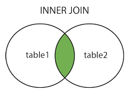
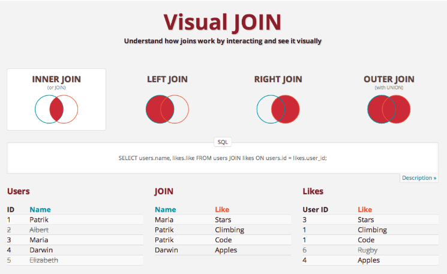

### SQL
SQL (Structured Query Language) is a programming language designed for managing data in a relational database. It's been around since the 1970s and is the most common method of accessing data in database. SQL has a variety of functions that allow its users to read, manipulate and change data.

### Database
A database is an organized collection of data.

### SQL SELECT
`SELECT` indicates which columns you'd like to view, and `FROM` identifies the table that they live in.

```
SELECT year, month, west FROM tutorial.us_housing_units;
```
The query is telling the database to return the `year`, `month`, and `west` columns from the table `tutorial.us_housing_units`.
If wants to select every column in a table, you can use `*` instead of the column names.
```
SELECT * FROM tutorial.us_housing_units;
```

### Column Names
```
SELECT west as "West Region", south AS "South Region" FROM tutorial.us_housing_units;
```

### SQL LIMIT command
```
SELECT * FROM tutorial.us_housing_units LIMIT 100;
```

### SQL WHERE
Filtering data using `WHERE` clause.
```
SELECT * FROM tutorial.us_housing_units WHERE month=1;
```
The results will only include rows where the `month` column contains the value `1`.

### SQL Comparison Operators
Comparison operators on numerical data: The most basic way to filter data using comparison operators. 
Equal to (=), Not equal to (<> or !=), Greater than (>), Less than (<), Greater than or equal to (>=), Less than or equal to (<=).
```
SELECT * FROM tutorial.us_housing_units WHERE west > 90;

SELECT * FROM tutorial.us_housing_units WHERE month_name != 'January';
```

Arithmetic in SQL: Arithmetic in SQL using the `+`, `-`, `*`, `/` operators.

```
SELECT year, month, west, south, west + south - 4 * year AS nonsense_column
FROM tutorial.us_housing_units;

SELECT year, (west + south)/2 AS south_west_avg
FROM tutorial.us_housing_units;
```

### SQL Logical Operators
Logical operators allow to use multiple comparison operators in one query.
* `LIKE` - allows to match similar values, instead of exact values.
* `IN` - allows to specify a list of values you'd like to include.
* `BETWEEN` - allows to select only rows within a certain range
* `IS NULL` - allows to select rows that contain no data in a given column
* `AND` - allows to select only rows that satisfy two conditions
* `OR` - allows to select rows that satisfy either of two conditions.
* `NOT` - allows to select rows that do not match a certain condition

### SQL LIKE
`LIKE` is a logical operator in SQL that allows to match on similar values rather than exact ones.
```
SELECT * FROM tutorial.billboard_top_100_year_end
WHERE group_name LIKE 'Snoop%';
```

`%` is referred to as a "Wildcard". `LIKE` is case-sensitive, meaning that the above query will only capture matches that start with a capital "S" and lower-case "noop". To ignore case when you're matching values, can use the `ILIKE` command.
```
SELECT * FROM tutorial.billboard_top_100_year_end
WHERE group_name ILIKE 'snoop%';
```

Use `_` (a single underscore) to substitute for an individual character
```
SELECT * FROM tutorial.billboard_top_100_year_end
WHERE artist ILIKE 'dr_ke';
```

### SQL IN
`IN` is a Logical operator in SQL that allows you to specify a list of values that you'd like to include in the results. 

```
SELECT * FROM tutorial.billboard_top_100_year_end
WHERE year_rank IN (1,2,3);

SELECT * FROM tutorial.billboard_top_100_end
WHERE artist IN ('Taylor Swift', 'Usher', 'Ludacris');
```

### SQL BETWEEN
`BETWEEN` is a logical operator in SQL that allows to select only rows that are within a specific range. It has to be paired with the `AND` operator.
```
SELECT * FROM tutorial.billboard_top_100_year_end
WHERE year_rank BETWEEN 5 AND 10;
```

### SQL IS NULL
`IS NULL` is a logical operator in SQL that allows to exclude rows with missing data from results. Some tables contain null values - cells with no data in them at all. Select rows that contain no data in a given column by using `IS NULL`.

```
SELECT * FROM tutorial.billboard_top_100_year_end
WHERE artist IS NULL;
```

### SQL AND
`AND` is a logical operator in SQL that allows to select rows that satisfy two conditions. 
```
SELECT * FROM tutorial.billboard_top_100_year_end
WHERE year = 2022 AND year_rank <= 10;

SELECT * FROM tutorial.billboard_top_10_year_end
WHERE year = 2022 AND year_rank <= 10 AND group_name ILIKE '%feat%';
```

### SQL OR
`OR` is a logical operator in SQL that allows to select rows that satisfy either of two conditions.
```
SELECT * FROM tutorial.billboard_top_100_year_end
WHERE year_rank = 5 OR artist = 'Gotye';
```

Combine AND with OR using parenthesis.
```
SELECT * FROM tutorial.billboard_top_100_year_end
WHERE year = 2013 
AND (group_name ILIKE '%macklemore%' OR group_name ILIKE '%timberlake%');
```

### SQL NOT
`NOT` is a logical operator in SQL that can put before any conditional statement to select rows for which that statement is false.

```
SELECT * FROM tutorial.billboard_top_100_year_end
WHERE year=2013 AND year_rank NOT BETWEEN 2 AND 3;
```

### SQL ORDER BY
The `ORDER BY` clause allows to record results based on the data in one or more columns. 

```
SELECT * FROM tutorial.billboard_top_100_year_end
ORDER BY artist;

SELECT * FROM tutorial.billboard_top_100_year_end
WHERE year = 2013
ORDER BY year_rank;

SELECT * FROM tutorial.billboard_top_100_year_end 
WHERE year = 2013
ORDER BY year_rank DESC;

SELECT * FROM tutorial.billboard_top_100_year_end
WHERE year_rank <= 3
ORDER BY year DESC, year_rank;
```

### Comments in SQL
-- Single line comment

/*
Multi-line
Comment
*/

### SQL Aggregate Functions
* `COUNT` - counts how many rows are in a particular column
* `SUM` - adds together all the values in a particular column
* `MIN` and `MAX` - return the lowest and highest values in a particular column, respectively.
* `AVG` - calculates the average of a group of selected values

### SQL Count
`COUNT` is a SQL aggregate function for counting the number of rows in a particular column.

```
SELECT COUNT(*) FROM tutorial.aapl_historical_stock_price;

SELECT COUNT(high) 
FROM tutorial.aapl_historical_stock_price;

SELECT COUNT(date) AS count_of_date
FROM tutorial.aapl_historical_stock_price;

SELECT COUNT(date) AS "Count of Date"
FROM tutorial.aapl_historical_stock_price;
```

`COUNT(1)` has the same effect as `COUNT(*)`.

### SQL SUM
`SUM` is a SQL aggregate function that totals the values in a given column. Unlike `COUNT`, `SUM` can only use on columns containing numerical values.

```
SELECT SUM(volume) 
FROM tutorial.aapl_historical_stock_price;
```

### SQL MIN/MAX
`MIN` & `MAX` are SQL aggregation functions that return the lowest and highest values in a particular column.

```
SELECT MIN(volume) AS min_volume, MAX(volume) AS max_volume
FROM tutorial.aapl_historical_stock_price;
```

### SQL AVG
`AVG` is a SQL aggregate function that calculates the average of a selected group of values. It can only be used on numerical columns and ignores nulls completely.

```
SELECT AVG(high)
FROM tutorial.aapl_historical_stock_price
WHERE high IS NOT NULL;
```

### SQL GROUP BY
`GROUP BY` allows to separate data into groups, which can be aggregated independently of one another.

```
SELECT year, COUNT(*) AS count 
FROM tutorial.aapl_historical_stock_price
GROUP BY year;

SELECT year, month, COUNT(*) AS count
FROM tutorial.aapl_historical_stock_price
GROUP BY year, month;
```

GROUP BY column numbers:
```
SELECT year, month, COUNT(*) AS count
FROM tutorial.aapl_historical_stock_price
GROUP BY 1,2;
```

Using GROUP BY with ORDER BY:
```
SELECT year, month, COUNT(*) AS count
FROM tutorial.aapl_historical_stock_price
GROUP BY year, month
ORDER BY month, year;
```

### SQL HAVING
```
SELECT year, month, MAX(high) AS month_high
FROM tutorial.aapl_historical_stock_price
GROUP BY year, month
HAVING MAX(high) > 400
ORDER BY year, month;
```

`HAVING` is the clean way to filter a query that has been aggregated.

### Query Clause Order
1. SELECT
2. FROM
3. WHERE
4. GROUP BY
5. HAVING
6. ORDER BY

### SQL CASE
The `CASE` statement is SQL's way of handling if/then login. The `CASE` statement is followed by at least one pair of `WHEN` and `THEN` statements. Every `CASE` statement must end with the `END` statement. The `ELSE` statement is optional and provides a way to capture values not specified in the `WHEN`/`THEN` statements. 

```
SELECT player_name, 
        year,
        CASE WHEN year='SR' THEN 'yes' ELSE 'no' END AS is_a_senior
FROM benn.college_football_players;
```

Adding multiple conditions to a CASE statement.
```
SELECT player_name,
    weight,
    CASE WHEN weight > 250 THEN 'over 250'
        WHEN weight > 200 AND weight <= 250 THEN '201-250'
        WHEN weight > 175 AND weight <= 200 THEN '176-200'
        ELSE '175 or under' END AS weight_group
FROM benn.college_football_players;
```

```
SELECT player_name,
    CASE WHEN year='FR' AND position='WR' THEN 'frosh_wr' ELSE NULL END AS sample_case_statement
FROM benn.college_football_players;
```

```
SELECT CASE WHEN year = 'FR' THEN 'FR'
    ELSE 'Not FR' END AS year_group,
    COUNT(1) AS count
FROM benn.college_football_players
GROUP BY CASE WHEN year='FR' THEN 'FR' 
ELSE 'Not FR' END;
```

```
SELECT CASE WHEN year='FR' THEN 'FR'
    WHEN year='SO' THEN 'SO'
    WHEN year='JR' THEN 'JO'
    WHEN year='SR' THEN 'SR'
    ELSE 'No Year Data' END AS year_group,
    COUNT(1) AS count
FROM benn.college_football_players
GROUP BY 1;
```

```
SELECT COUNT(CASE WHEN year='FR' THEN 1 ELSE NULL END) AS fr_count,
COUNT(CASE WHEN year='SO' THEN 1 ELSE NULL END) AS so_count
FROM benn.college_football_players;
```

### SQL DISTINCT
Returns the unique values in a particular column using `SELECT DISTINCT` syntax.
```
SELECT DISTINCT month
FROM tutorial.aapl_historical_stocK_price;
```
If includes two or more columns in a `SELECT DISTINCT` clause, results will contain all of the unique pairs of those columns.
```
SELECT DISTINCT year, month
FROM tutorial.aapl_historical_stock_price;
```

```
SELECT COUNT(DISTINCT months) AS unique_months
FROM tutorial.aapl_historical_stock_price;
```

It's worth nothing that using `DISTINCT`, particularly in aggregations, can slow queries down quite a bit.

### SQL Joins
Anatomy of a join:
```
SELECT teams.conference AS conference,
    AVG(players.weight) AS average_weight
FROM benn.college_football_players players
JOIN benn.college_football_teams teams
ON teams.school_name = players.school_name
GROUP BY teams.conference
ORDER BY AVG(players.weight) DESC;
```

Aliases in SQL: When performing joins, it's easiest to give table names aliases, like `benn.college_football_players players`.

JOIN and ON: `ON` indicates how the two tables relate to each other. `ON teams.school_name = players.school_name`

```
SELECT *
FROM benn.college_football_players players
JOIN benn.college_school_teams teams
ON teams.school_name = players.school_name;
```

### SQL INNER JOIN
Inner join can be written as either `JOIN ... ON` or `INNER JOIN ... ON`. Inner joins eliminate rows from both tables that do not satisfy the join condition set forth in the `ON` statement. In mathematical terms, an inner join is the intersection of the two tables.

Therefore, if a player goes to a school that isn't in the teams, that player won't be included in the result from an inner join. Similarly, if there are schools in the teams table that don't match to any schools in the players table, those rows won't be included in the results either.

Joining tables with identical column names:

```
SELECT players.*,
    teams.*
FROM benn.college_football_players players
JOIN benn.college_football_teams teams
ON teams.school_name = players.school_name;
```

### SQL Outer Joins
Outer joins are joins that return matched values and unmatched values from either or both tables. There are a few types of outer joins:
* `LEFT JOIN`: returns only unmatched rows from the left tabel, as well as matched rows in both tables.
* `RIGHT JOIN`: returns only unmatched rows from the right table, as well as matched rows in both tables.
* `FULL OUTER JOIN`: returns unmatched rows from both tables, as well as matched rows in both tables.

`LEFT JOIN` is also referred to as `OUTER LEFT JOIN`. `RIGHT JOIN` is also referred to as `OUTER RIGHT JOIN`. `FULL OUTER JOIN` is also referred to as `OUTER JOIN`.

Outer Joins vs. Inner join: When performing an inner join, rows from wither table that are unmatched in the other table are not returned. In an outer join, unmatched rows in one or both tables can be returned.
```
SELECT users.name, likes.like FROM users
JOIN likes 
ON users.id = likes.user_id;
```



### SQL LEFT JOIN

```
SELECT companies.permalink AS companies_permalink, companies.name AS companies_name, acquisitions.company_permalink AS acquisitions_permalink,
acquisitions.acquired_at AS acquired_date
FROM tutorial.crunchbase_companies companies
LEFT JOIN tutorial.crunchbase_acquisition acquisitions
ON companies.permalink=acquisitions.company_permalink;
```

### SQL RIGHT JOIN
Right joins return all rows from the table in the `RIGHT JOIN` clause and only matching rows from the table in the `FROM` clause.
`RIGHT JOIN` is rarely used because it can achieve the results of a `RIGHT JOIN` by simply switching the two tables names in a `LEFT JOIN`.
Same results for LEFT JOIN & RIGHT JOIN (Produces the same result):
```
SELECT companies.permalink AS companies_permalink, companies.name AS companies_name, acquisitions.company_permalink AS acquisitions_permalink, acquisitions.acquired_at AS acquired_date
FROM tutorial.crunchbase_acquisitions acquisitions
RIGHT JOIN tutorial.crunchbase_companies companies
ON companies.permalink = acquisitions.company_permalink;

SELECT companies.permalink AS companies_permalink, companies.name AS companies_name, acquisitions.company_permalink AS acquisitions_permalink, acquisitions.acquired_at AS acquired_date
FROM tutorial.crunchbase_companies companies
LEFT JOIN tutorial.crunchbase_acquisitions acquisitions
ON companies.permalink = acquisitions.company_permalink;
```

`LEFT JOIN` & `RIGHT JOIN` can be written as `LEFT OUTER JOIN` & `RIGHT OUTER JOIN` respectively.

### SQL Joins Using WHERE or ON
Filtering in the ON clause: Normally filtering is processed in the `WHERE` clause once the two tables have already been joined. It's possible to filter one or both of the tables before joining them. 
```
SELECT companies.permalink AS companies_permalink, companies.name AS companies_name, acquisitions.company_permalink AS acquisitions_permalink, acquisitions.acquired_at AS acquired_date
FROM tutorial.crunchbase_companies companies
LEFT JOIN tutorial.crunchbase_acquisitions acquisitions
ON companies.permalink = acquisitions.company_permalink
AND acquisitions.company_permalink != '/company/1000memories'
ORDER BY 1;
```
Above query returns everything in the `tutorial.crunchbase_acquisitions` table was joined on except for the row for which company_permalink is '/company/1000memories'. The conditional statement `AND ...` is evaluated before the join occurs. 

Filtering in the WHERE clause: If move the same filter to the `WHERE` clause, will notice that the filter happens after the tables are joined. The result is that the 1000memories row is joined onto the original table, but then it is filtered our entirely(in both tables) in the `WHERE` clause before displaying results.
```
SELECT companies.permalink AS companies_permalink, companies.name AS companies_name, acquisitions.company_permalink AS acquisitions_permalink, acquisitions.acquired_at AS acquired_date
FROM tutorial.crunchbase_acquisitions acquisitions
LEFT JOIN tutorial.crunchbase_acquisitions acquisitions
ON companies.permalink = acquisitions.company_permalink
WHERE acquisitions.company_permalink != '/company/1000memories'
OR acquisitions.company_permalink IS NULL
ORDER BY 1;
```