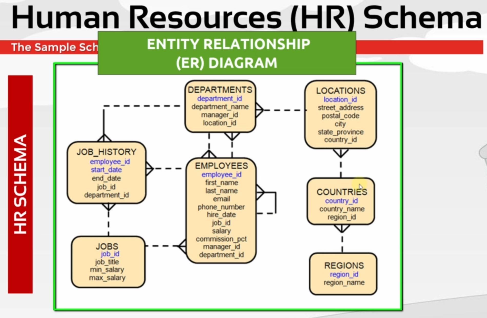

# The Complete PL/SQL Bootcamp Beginner to Advanced PL/SQL

### What is PL/SQL

- PL/SQL stands for Procedural Language/Structured Query Language
- It is Oracle's extension of SQL - meaning it adds programming features to normal SQL
- SQL can only query and manipulate data
- PL/SQL can do loops, conditions, functions, procedures, error handling etc
- PL/SQL -> SQL + Procedural Programming
- Platform Independence (Mac, Windows, Linux)

### Why use PL/SQL

- Group multiple SQL statements together
- Add Login (IF, FOR, WHILE)
- Performance
- Error Handling
- Reusability
- Security

### PL/SQL Architecture

The architecture in two parts, Physical Architecture and Logical Architecture.
Physical Architecture:
When PL/SQL code executes, it interacts with:

- SQL Engine (To handle SQL statements)
- PL/SQL Engine (To handle PL/SQL Code)
- Database Server (To Store and Fetch Data)

How it works Step-by-step:

- Submit a PL/SQL block
- PL/SQL engine checks the block, if it's PL/SQL logic, executes immediately, if it's a SQL statement, sends it to the SQL engine
- SQL engine handle the SQL, return the result to PL/SQL if needed.
- PL/SQL engine continues the running
- Results are returned or stored

- Diagram

```
    PL/SQL Block
        ↓
   PL/SQL Engine
       /    \
(PL/SQL logic) (SQL Statements)
     ↓              ↓
Execute        SQL Engine
                  ↓
          Database Server
```

Logical Architecture:

- Cooperates with SQL engine
- Enables subprograms
- Dynamic Queries
- Case Insensitivity
- Optimizer
- Enable Object Oriented Programming

### The Sample (HR) Schema

- What is Schema?
  => Schemas are the collection of objects for each user in Oracle Database. In Oracle Database, a schema is a collection of database objects that belong to a specific user. These objects can include tables, views, indexes, sequences, procedures, functions, packages, and other structures. Each user account in Oracle has its own schema, and the schema name is the same as the username.

- A schema is a logical container for objects created by a user
- It helps organize and manage database objects
- Access to objects in a schema can be controlled through permissions.

For example, if a user named HR creates a table called EMPLOYEES, the fully qualified name of the table would be HR.EMPLOYEES, indicating that the EMPLOYEES table belongs to the HR schema.



### About the database installation

1. Having with using VirtualBox
2. Installing Database into computer

### Which Option to Choose to Have a Database

Three Options to Have a Database

1. Using the VirtualBox Option
2. Installing Database into computer
3. Using Oracle Live SQL (https://livesql.oracle.com/landing/)

### Option 1 Having the Database with the Oracle Virtual Box

1. Download & Install Virtual Box: https://www.virtualbox.org/
2. Download Oracle VM with Database (Recommended for this tutorial): https://drive.usercontent.google.com/download?id=1JDM28LwcA_AvLAJyYJfLAOI6_4oLTMBn&export=download&authuser=0

Otherwise, Download Pre-Built Developer VMs (for Oracle VM VirtualBox) (Download Database App Development VM): https://www.oracle.com/downloads/developer-vm/community-downloads.html

3. Import Downloaded Machine to VirtualBox:
   Open VirtualBox -> File -> Import Appliance -> Select the downloaded machine -> Import

4. Run the imported virtual disk image. (If there is not full screen for the first time, restart it.)

5. For Oracle VM with Database virtual disk image, Username: oracle, password: oracle

6. For system schema, Username: system, password: oracle

### What is Pluggable Database

A pluggable database (PDB) in Oracle is a portable collection of schemas, schema objects and non-schema objects that appears to an Oracle client as a non-CDB(non-container database). However, it actually exists within a multitenant container database (CDB).

- A CDB(Container Database) can contain zero, one or many PDBs.
- Each PDB is isolated from others and can be plugged in or unplugged from a CDB.
- PDBs share the CDB's memory and background processes, but have their own data and metadata.
- This architecture makes it easier to manage, move and consolidate databases.

### Option 2 Downloading and Installing the Oracle Database

1. Download Required Version (19c, 11c, 21c etc) (Express Edition, Standard Edition, Exterprise Edition) Zip File of Oracle Database (https://www.oracle.com/database/technologies/oracle-database-software-downloads.html) & Extract the zip folder
2. Create a Folder inside C drive (Example: OracleApp) & Paste the extracted folder inside the OracleApp folder
3. Open setup.exe & Install the Oracle data

### Option 2 Unlocking the HR Schema

Open Command Terminal & run the below commands:

1. `sqlplus / as sysdba;`
   Opens the SQL\*Plus command line tool and connects to the oracle database as a privileged user (SYSDBA), allowing you to perform administrative tasks.
2. `alter session set container=orclpdb;`
   Switches current session to the pluggable database named orclpdb, so that subsequent commands affect this specific PDB
3. `alter pluggable database open;`
   Opens the pluggable database (PDB) so it becomes available for use (accepts connections and operations).
4. `alter pluggable database orclpdb save state;`
   Saves the current open/closed state of the PDB (orclpdb), so it will automatically open in the same state after a database restart.
5. `alter user hr identified by hr account unlock;`
   Unlocks the HR user account and sets its password to hr, making it possible to log in as HR.
6. `/`

### Option 2 Configuring and Using the SQL Developer

1. Download Oracle SQL Developer Zip folder & Unzip the folder (https://www.oracle.com/database/sqldeveloper/technologies/download/)
2. Open sqldeveloer.exe from the folder
3. Create a database connection using the below ways

- Provide the information: Name, username, password, Connection type(Basic), Hostname, Port, Service name
- Provide the information: Name, username, password, Connection Type(TNS), Network Alias

4. sys user: It is the default superuser account. It owns all the base tables and views for the database's data dictionary. SYS has the highest level of privileges and is used for critical database administration tasks. SYS = main superuser, owns core database structures.
5. SYSTEM user: It is another administrative account. It owns additional tables and views used for database management and internal tools, but not for the core data dictionary. SYSTEM = administrative user, used for general database management.

### Option 3 Using Oracle Live SQL

1. Oracle Live SQL: https://livesql.oracle.com/landing/

### Blocks

- What are blocks?
  -> In PL/SQL, a block is the basic unit of code. It is a group of related declarations and statements that are executed together. Every PL/SQL program is made up of one or more blocks.

A PL/SQL block has three main sections:

- Declaration Section (Optional): Where declare variables, constants, cursors, etc.
- Execution Section (mandatory): Where write the executable statements (logic, SQL, etc).
- Exception handling Sections (optional): Where handle errors or exceptions

The general structure is:

```
DECLARE
   -- Declarations (optional)
BEGIN
   -- Executable statements (mandatory)
EXCEPTION
   -- Exception handling (optional)
END;
```

Three types of blocks:

- Anonymous Blocks
- Procedures
- Functions

### PL/SQL Outputs

In PL/SQL, outputs refer to the results or information produced by executing a PL/SQL blocks. The most common ways to produce output in PL/SQL are:

1. DBMS_OUTPUT.PUT_LINE:
   This built-in procedure displays text output to the screen. It is mainly used for debugging or showing messages.

```
SET SERVEROUTPUT ON;

BEGIN
   DBMS_OUTPUT.PUT_LINE('Hello, World!');
END;
```

2. SELECT statements:
   When used in a PL/SQL block, SELECT statements can fetch data into variables, but they do not directly display output unless combined with DBMS_OUTPUT

3. OUT parameters:
   Procedures and functions can return values to the caller using OUT or IN OUT parameters.

4. RETURN statement:
   Functions return a value using the RETURN statement

5. EXCEPTIONS:
   When an error occurs, PL/SQL can output error messages using exception handling and DBMS_OUTPUT

### Nested Blocks:

In PL/SQL, nested blocks are PL/SQL blocks placed inside other PL/SQL blocks. This allows to structure code with inner blocks that have their own declarations, logic and exception handling, separate from the outer block.

- Inner (bested) blocks can access variables declared in the outer block, but not vice versa
- Each block can have its own exception section
- Useful for organizing code, limiting the scope of variables, and handling exceptions locally.

```
SET SERVEROUTPUT ON;
DECLARE
   outer_var NUMBER := 10;
BEGIN
   DBMS_OUTPUT.PUT_LINE('Outer block: ' || outer_var);

   DECLARE
      inner_var NUMBER := 20;
   BEGIN
      DBMS_OUTPUT.PUT_LINE('Inner block: ' || inner_var);
      DBMS_OUTPUT.PUT_LINE('Accessing outer_var from inner block: ' || outer_var);
   END;

   -- inner_var is not accessible here
   -- DBMS_OUTPUT.PUT_LINE(inner_var); -- This would cause an error
END;
```

### What are variables?

In PL/SQL, variables are named storage locations that hold data values during the execution of a program & can assign, change and use their values in code.

### Why do we need variables?

- To temporarily store data for processing (such as numbers, text, dates, etc)
- To hold results from queries or calculations
- To make code flexible and reusable by allowing values to change during execution
- To pass data between different parts of a program (such as between blocks, procedures, or functions)

### PL/SQL Variable Types:

1. Scalar Types: Store a single value
   - NUMBER: For numeric values (integers, decimals)
   - VARCHAR2, CHAR: For character strings
   - DATE, TIMESTAMP: For date and time values
   - BOOLEAN: For logical values (TRUE, FALSE, NULL)
2. Composite Types: Store multiple values or a collection
   - RECORD: A group of related data items (like a row)
   - TABLE, VARRAY, NESTED TABLE: Collections of elements (arrays/lists)
3. REFERENCE TYPES:
   - CURSOR: Used to handle query result sets
   - REF CURSOR: Pointer to a cursor
4. LOB Types:
   - BLOB, CLOB, NCLOB: For large binary or character data

### Variable Naming Rules:

- The name must begin with a letter
- It can include letters, numbers, and the symbols \_, $, $
- Maximum length is 30 characters
- Names are not case-sensative (myVar and MYVAR are the same)
- Cannot use reserved words like SELECT, BEGIN, etc
- Avoid starting with PL/SQL reserved prefixes (like "SYS\_")

### Naming Conventions

- VARIABLE(v_variable_name): v_max_salary
- CURSOR(cur_cursor_name): cur_employees
- EXCEPTION(e_exception_name): e_invalid_salary
- PROCEDURE(p_procedure_name): p_calculate_salary
- BIND VARIABLE(b_bind_name): b_emp_id

### Declaring & Initializing & Using Variables

General Usage:
`Name [CONSTANT] datatype [NOT NULL] [:= DEFAULT value|expression]`

Examples:

```
-----------------------===================-----------------------
-----------------------DECLARING VARIABLES-----------------------
-----------------------===================-----------------------
SET SERVEROUTPUT ON;
DECLARE
    v varchar2(20) := 2 + 25 * 3;
BEGIN
    dbms_output.put_line(v);
END;
-----------------------===================-----------------------
DECLARE
    v_text varchar2(50) NOT NULL DEFAULT 'Hello';
    v_number1 number := 50;
    v_number2 number(2) := 50.42;
    v_number3 number(10,2) := 50.42;
    v_number4 PLS_INTEGER := 50;
    v_number5 BINARY_float := 50.42;
    v_DATE1 DATE := '22-NOV-18 12:01:32';
    v_DATE2 timestamp := systimestamp;
    v_DATE3 timestamp(9) WITH TIME ZONE := systimestamp;
    v_DATE4 interval day(4) to second (3) := '124 02:05:21.012 ';
    v_DATE5 interval year to month := '12-3';
BEGIN
    V_TEXT := 'PL/SQL' || 'Course';
    DBMS_OUTPUT.PUT_LINE(V_TEXT);
    DBMS_OUTPUT.PUT_LINE(v_number1);
    DBMS_OUTPUT.PUT_LINE(v_number2);
    DBMS_OUTPUT.PUT_LINE(v_number3);
    DBMS_OUTPUT.PUT_LINE(v_number4);
    DBMS_OUTPUT.PUT_LINE(v_number5);
    DBMS_OUTPUT.PUT_LINE(v_DATE1);
    DBMS_OUTPUT.PUT_LINE(v_DATE2);
    DBMS_OUTPUT.PUT_LINE(v_DATE3);
    DBMS_OUTPUT.PUT_LINE(v_DATE4);
    DBMS_OUTPUT.PUT_LINE(v_DATE5);
    END;
----------------==================================---------------
----------------USING BOOLEAN DATA TYPE in PL/SQL----------------
----------------==================================---------------
DECLARE
    v_boolean boolean := true;
BEGIN
    dbms_output.put_line(sys.diutil.bool_to_int(v_boolean));
END;
----------------==================================---------------
```

\*\*\* DATE, TIMESTAMP, TIMESTAMP WITH TIME ZONE & INTERVAL

### USING %TYPE ATTRIBUTE

IN PL/SQL, the %TYPE attribute is used to declare a variable with the same data types as a column in a table or as another variable. This ensures that variable always matches the column's or variable's data type, even if the table definition changes later.

```
DECLARE
   V_TYPE employees.job_id%TYPE;
   V_TYPE2 V_TYPE%TYPE;
BEGIN
   V_TYPE := 'IT PROG';
   V_TYPE2 := 'SAM';
END;
```

### Delimiters & Commenting in Code

Delimiters:

- A PL/SQL block starts with DECLARE, then BEGIN and ends with END.
- Each statement inside the block ends with a semicolon
- String literals are enclosed in single quotes ('example')
- Parentheses () are used for grouping and function/procedure calls
- Commas separate items in lists
- - (Addition), - (Subtraction | Negation), \* (Multiplication), / (Division), = (Equality), @ (Remote Access), ; (Statement), <> (Inequality), != (Inequality), || (Concatenation), := (Assignment), -- (Single line comment), /\*\*/ (Multi line comment)

### PL/SQL variable scope

In PL/SQL, variable scope refers to where a variable can be accessed or used within code.

- A variable declared in the outer block is accessible in all its inner blocks
- A variable declared in an inner block is only accessible within that inner block - not in the outer block.
- If a variable with the same name is declared in both an outer and an inner block, the block's variable takes precedence (local scope)

This means:

- Outer block variables have wider scope within the block and its sub blocks
- Inner block variables have a local scope, limited to the block where they are declared.

```
SET SERVEROUTPUT ON;
DECLARE
   v_outer NUMBER := 100; -- Outer block variable
BEGIN
   DBMS_OUTPUT.PUT_LINE('Outer block: v_outer = ' || v_outer);

   DECLARE
      v_inner NUMBER := 200; -- Inner block variable
      v_outer NUMBER := 300; -- This shadows the outer v_outer
   BEGIN
      DBMS_OUTPUT.PUT_LINE('Inner block: v_inner = ' || v_inner);
      DBMS_OUTPUT.PUT_LINE('Inner block: v_outer = ' || v_outer); -- Refers to inner v_outer
   END;

   -- v_inner is not accessible here
   -- DBMS_OUTPUT.PUT_LINE(v_inner); -- This would cause an error

   DBMS_OUTPUT.PUT_LINE('Outer block again: v_outer = ' || v_outer); -- Refers to outer v_outer
END;
```

### Bind Variable

A bind variable in PL/SQL is a variable that is declared and used outside the PL/SQL block, typically in tools like SQL\*Plus, SQL Developer or application code. Bind variable allow to pass values into and out of PL/SQL blocks, procedures, or SQL statement at runtime.

- Bind variables are prefixed with a colon (:b_emp_id)
- They are defined in the host environment, not inside the PL/SQL block.
- They help improve performance by allowing SQL statements to be reused with different values, and they help prevent SQL injection.

```
VARIABLE b_emp_id NUMBER;

BEGIN
   :b_emp_id := 101;
END;
/

SELECT first_name from employees WHERE employee_id = :b_emp_id;
```

### What are control structures and if statements?

In PL/SQL, control structures are programming constructs that control the flow of execution in code. The main types are:

1. Conditional control (IF statements): Used to execute code only if certain conditions are true
2. Iterative control (Loops): Used to repeat a block of code multiple times (FOR, WHILE Loop)
3. Sequential Control (GOTO, EXIT): Used to change the normal sequence of execution

IF statements are a type of conditional control structure. They allow to execute certain statements only when a condition is true.

```
IF condition1 THEN
   --- statements
ELSIF condition2 THEN
   --- statements
ELSE
   --- statements
END IF;
```

```
SET SERVEROUTPUT ON;

DECLARE
   v_salary NUMBER := 4000;
BEGIN
   IF v_salary > 5000 THEN
      DBMS_OUTPUT.PUT_LINE('Salary is above 5000');
   ELSIF v_salary = 5000 THEN
      DBMS_OUTPUT.PUT_LINE('Salary is exact 5000');
   ELSE
      DBMS_OUTPUT.PUT_LINE('Salary is below 5000');
   END IF;
END;
```

### AND, OR, NOT Logical Operators

In PL/SQL, AND, OR, and NOT are logical operators used in conditions (such as IF statements) to combine or reverse logical expressions.

- AND: Returns true if both conditions are true.
- OR: Returns true if at least one condition is true
- NOT: Reverses the logical value

```
IF salary > 3000 AND department_id = 10 THEN
   DBMS_OUTPUT.PUT_LINE('High salary in department 10');
END IF;

IF salary < 2000 OR department_id = 20 THEN
   DBMS_OUTPUT.PUT_LINE('Low salary or in department 20');
END IF;

IF NOT (salary = 5000) THEN
   DBMS_OUTPUT.PUT_LINE('Salary is not 5000');
END IF;
```

### Case Expression

In PL/SQL, CASE expressions are used to perform conditional logic, similar to IF-THEN-ELSE, but in a more compact form. They allow to return a value based on different conditions.

There are two types of CASE expressions:

1. Simple CASE expression:

```
CASE variable
   WHEN value1 THEN result1
   WHEN value2 THEN result2
   ELSE default_result
END
```

```
DECLARE
   grade CHAR := 'B';
   result VARCHAR2(20);
BEGIN
   result := CASE grade
      WHEN 'A' THEN 'Excellent'
      WHEN 'B' THEN 'Good'
      WHEN 'C' THEN 'Average'
      ELSE 'Needs Improvement'
   END;
   DBMS_OUTPUT.PUT_LINE('Result: ' || result);
END;
```

2. Searched CASE Expression:

```
CASE
   WHEN condition1 THEN result1
   WHEN condition2 THEN result2
   ELSE default_result;
END;
```

```
SET SERVEROUTPUT ON;

DECLARE
   score NUMBER := 78;
   grade VARCHAR2(20);
BEGIN
   grade := CASE
      WHEN score >= 90 THEN 'A'
      WHEN score >= 80 THEN 'B'
      WHEN score >= 70 THEN 'C'
      ELSE 'F'
   END;
   DBMS_OUTPUT.PUT_LINE('Grade: ' || grade);
END;
```

### What are loops - basic loops

In PL/SQL, loops are control structures that allow to repeatedly execute a block of code multiple times.

A basic loop (also called a simple or unconditional loop) repeats its statements until explicitly exit the loop using an EXIT or EXIT WHEN statement.

```
LOOP
   -- statements
   EXIT WHEN condition; -- or just EXIT;
END LOOP;
```

```
DECLARE
   counter NUMBER := 1;
BEGIN
   LOOP
      DBMS_OUTPUT.PUT_LINE('Counter: ' || counter);
      counter := counter + 1;
      EXIT WHEN counter > 5;
   END LOOP;
END;
```

### WHILE Loops

In PL/SQL, a WHILE loop repeatedly executes a block of code as long as a specified condition is true. The condition is checked before each iteration.

```
WHILE condition LOOP
   -- statements
END LOOP;
```

```
DECLARE
   counter NUMBER := 1;
BEGIN
   WHILE counter <= 5 LOOP
      DBMS_OUTPUT.PUT_LINE('Counter: ' || counter);
      counter := counter + 1;
   END LOOP;
END;
```

### FOR Loops

In PL/SQL, a FOR loop is used to execute a block of code a specific number of times. The loop variable automatically takes on each integer value in a specified range.

```
FOR counter IN [REVERSE] lower_bound..upper_bound LOOP
   -- statements
END LOOP;
```

```
DECLARE
   i number;
BEGIN
   FOR i IN 1..5 LOOP
      DBMS_OUTPUT.PUT_LINE('Counter: ' || i);
   END LOOP;
END;
```

```
FOR i IN REVERSE 5..1 LOOP
   DBMS_OUTPUT.PUT_LINE('Counter: ' || i);
END LOOP;
```

### Nested Loops & Loop labeling

In PL/SQL, nested loops are loops placed inside other loops. Can use them to perform repeated actions within each iteration of an outer loop. Loop labeling helps to identify and control specific loops, especially when using EXIT or CONTINUE statements to exit from or continue a particular loop.

```
<<outer_loop>>
FOR i IN 1..3 LOOP
   DBMS_OUTPUT.PUT_LINE('Outer loop: ' || i);

   <<inner_loop>>
   FOR j IN 1..2 LOOP
      DBMS_OUTPUT.PUT_LINE('Inner loop: ' || j);

      IF i = 2 AND j = 1 THEN
         EXIT outer_loop;
      END IF;
   END LOOP inner_loop;
END LOOP outer_loop;
```

### CONTINUE statement

In PL/SQL, the CONTINUE statement is used inside loops to skip the remaining statements in the current iteration and move to the next iteration of the loop. Can also use CONTINUE WHEN condition; to skip to the next iteration only when a specific condition is true.

```
CONTINUE;
--- or
CONTINUE WHEN condition;
```

```
DECLARE
   i number;
BEGIN
   FOR i IN 1..5 LOOP
      IF MOD(i, 2) = 0 THEN
         CONTINUE;
      END IF;
      DBMS_OUTPUT.PUT_LINE('Odd number: ' || i);
   END LOOP;
END;
```

With loop labeling

```
<<my_loop>>
FOR i IN 1..5 LOOP
   CONTINUE my_loop WHEN i = 3;
   DBMS_OUTPUT.PUT_LINE('i= ' || i);
END LOOP;
```

### GOTO statement

In PL/SQL, the GOTO statement allows to transfer control unconditionally to a labeled statement within the same block; It is rarely used in modern code because it can make programs harder to read and maintain, but it can be useful in certain situations.

```
GOTO label_name
----
<<label_name>>
   -- statements
```

```
DECLARE
   v_num NUMBER := 1;
BEGIN
   IF v_num = 1 THEN
      GOTO skip_section;
   END IF;

   DBMS_OUTPUT.PUT_LINE(' This will be skipped');

   <<skipped_section>>
   DBMS_OUTPUT.PUT_LINE('GOTO jumped to this line');
END;
```

### Operating With Selected Queries

- Why to use SQL in PL/SQL?

  - Use SQL in PL/SQL to combine the power of SQL for data manipulation (such as SELECT, INSERT, UPDATE, DELETE) with the procedural capabilities of PL/SQL (such as variables, loops, conditions, and error handling). This allows to:
  - Retrieve, modify and manage data in the database directly from PL/SQL code
  - Automate complex business logic that involves multiple SQL operations.
  - Improve performance by reducing the number of calls between application and database.
  - Handle exceptions and control flow around SQL statements.

- There are some issues?

  - Can't use DDL commands directly.
  - A block does not mean a transaction

- How to use SQL in PL/SQL/

```
SELECT columns|expressions
INTO variables|records
FROM table|tables
[WHERE condition]
```

```
SELECT column1, column2
INTO variable1, variable2
FROM table_name
WHERE condition;
```

```
DECLARE
   v_name employees.first_name%TYPE;
   v_id employees.employee_id%TYPE = 101;
BEGIN
   SELECT first_name
   INTO v_name
   FROM employees
   WHERE employee_id = v_id;

   DBMS_OUTPUT.PUT_LINE('Employee Name: ' || v_name);
END;
```

### Naming Convention & Ambiguities

- Naming Convention:
  - Use clear, descriptive names that indicate the purpose of the variable, cursor, exception, etc.
  - Prefixes are often used to indicate type or scope:
    - v\_ for variable (v_salary)
    - cur\_ for cursors (cur_employees)
    - e\_ for exceptions (e_not_found)
    - p\_ for procedure parameters (p_emp_id)
    - b\_ for bind variables (b_dept_id)
  - Use underscores to separate words in multi-word names (total_salary, start_date)
  - Use Uppercase for constants (MAX_LIMIT)
  - Avoid using reserved words or names that too generic (value, number)
- Ambiguities"
  - If a variable and a column have the same name in a SQL statement, Oracle treats the name as a column by default. To avoid ambiguity, use table aliases or different names.
  - In nested block, if a variable is declared with the same name as an outer block variable, the inner variable "shadows" the outer one within its scope.
  - Always use meaningful and distinct names to prevent confusion and accidental errors in code.

### DML Operations in PL/SQL

DML (Data Manipulation Language) operations are used to manipulate data in database tables. In PL/SQL, can use DML statements directly inside PL/SQL blocks to insert, update, delete or select data.

Common DML operations:

- INSERT: Add new rows to a table
- UPDATE: Modify existing rows in a table
- DELETE: Remove rows from a table
- SELECT ... INTO: Retrieve data from a table into PL/SQL variables

-- INSERT example

```
BEGIN
   INSERT INTO employees (employee_id, first_name, last_name) VALUE (999, 'John', 'Doe');
END;
```

-- UPDATE example

```
BEGIN
   UPDATE employees
   SET salary = salary * 1.1
   WHERE department_id = 10;
END;
```

-- DELETE example

```
BEGIN
   DELETE FROM employees
   WHERE employee_id = 999;
END;
```

-- SELECT INTO example

```
DECLARE
   v_salary employee.salary%TYPE;
BEGIN
   SELECT salary INTO v_salary
   FROM employees
   WHERE employee_id = 100;
   DBMS_OUTPUT.PUT_LINE('Salary: ' || v_salary);
END;
```

- DML statements in PL/SQL blocks are part of the current transaction. Can use COMMIT to save changes or ROLLBACK to undo them.
- Always handle exceptions for DML operations to manage errors gracefully.

### Sequences in PL/SQL

A sequence in Oracle is a database object that generates a sequence of unique numeric values, often used for auto-incrementing primary keys.. In PL/SQL, can use sequences to generate unique numbers for inserting into tables.

- How to use a sequence in PL/SQL:
  - Use sequence_name.NEXTVAL to get the next value in the sequence
  - Use sequence_name.CURRVAL to get the current value (after at least one NEXTVAL call in the session)

-- Assuming a sequence named emp_seq exists

```
DECLARE
   v_new_id NUMBER;
BEGIN
   v_new_id := emp_seq.NEXTVAL;
   INSERT INTO employees (employee_id, first_name, last_name)
   VALUES (v_new_id, 'John', 'Doe');
END;
```

- Sequences are independent of tables and can be used by multiple users.
- Useful for generating unique keys in multi-user environments.
- Can't use NEXTVAL or CURRVAL in the VALUES clause of a SELECT statement without inserting or updating data.

-- Creating a sequence

```
CREATE SEQUENCE emp_seq
   START WITH 1
   INCREMENT BY 1
   NOCACHE
   NOCYCLE;
```

### Simple Data Types Vs Composite Data Types

Simple Data Types (Scalar Types):

- Hold a single value
- Examples:
  - NUMBER (v_num NUMBER := 10)
  - VARCHAR2 (v_name VARCHAR2 := 'John')
  - CHAR
  - DATE
  - BOOLEAN
- Used for basic data storage and manipulation

Composite Data Types:

- Can hold multiple values or a collection of values
- Examples:
  - RECORD: A group of related data items, possibly of different types (like a row in a table)
  ```
  TYPE emp_rec IS RECORD (id NUMBER, name VARCHAR2(20));
  v_emp emp_rec;
  ```
  - TABLE, VARRAY, NESTED TABLE: Collections (array/lists) of elements.
  ```
  TYPE num_table IS TABLE OF NUMBER;
  v_nums num_table := num_table(1,2,3);
  ```
  - Used for handling complex data structures and sets of data

### PL/SQL Records

- What is a record?
  A record in PL/SQL is a composite data type that allows to group related data items of different types into a single unit, similar to a row in a table. Each field in a record can have a different data type, and can access each field individually.

Why use records?

- To handle entire rows of data easily.
- To group related variables together for better organization and readability.

How to define and use a record:

1. Define a record type:

```
TYPE emp_rec IS RECORD (
   emp_id NUMBER,
   emp_name VARCHAR2(50),
   salary NUMBER
);
```

2. Declare a variable of that record type:

```
v_employee emp_rec;
```

3. Assign values and access fields:

```
v_employees.emp_id := 101;
v_employees.emp_name := 'John Doe';
v_employees.salary := 5000;

DBMS_OUTPUT.PUT_LINE('Name: ' || v_employees.emp_name);
```

Example Using a table row:

```
DECLARE
   TYPE emp_rec IS RECORD(
      emp_id employees.employee_id%TYPE,
      emp_name employees.first_name%TYPE,
      salary employees.salary%TYPE
   );

   v_emp emp_rec;
BEGIN
   SELECT employee_id, first_name, salary
   INTO v_emp
   FROM employees
   WHERE employee_id = 100;
END;
```

### DML with Records

Can use Records to perform DML operations (SELECT, INSERT, UPDATE, DELETE) more efficiently, especially when dealing with entire rows of data.

1. SELECT INTO a Record
   Fetch a row from a table directly into a record:

```
DECLARE
   TYPE emp_rec IS RECORD (
      emp_id employees.employee_id%TYPE,
      emp_name employees.first_name%TYPE,
      salary employees.salary%TYPE
   );
   v_emp emp_rec;
BEGIN
   SELECT employee_id, first_name, salary
   INTO v_emp
   FROM employees
   WHERE employee_id = 100;

   DBMS_OUTPUT.PUT_LINE('Name: ' || v_emp.first_name || ', Salary: ' || v_emp.salary);
END;
```

2. INSERT Using a Record

```
DECLARE
   TYPE emp_rec IS RECORD (
      emp_id employees.employee_id%TYPE,
      emp_name employees.first_name%TYPE,
      salary employees.salary%TYPE
   );
   v_emp emp_rec;
BEGIN
   v_emp.emp_id := 200;
   v_emp.emp_name := 'Jane';
   v_emp.salary := 6000;

   INSERT INTO employees (emp_id, emp_name, salary)
   VALUES (v_emp.emp_id, v_emp.emp_name, v_emp.salary);
END;
```

3. Update Using a Record

```
BEGIN
   UPDATE employees
   SET salary = v_emp.salary
   WHERE employee_id = v_emp.emp_id;
END;
```

4. DELETE Using a Record

```
BEGIN
   DELETE FROM employees
   WHERE employee_id = v_emp.emp_id;
END;
```

### What are COLLECTIONS?

In PL/SQL, collections are composite data types that allow to store and manipulate multiple values (elements) as a single unit, similar to arrays or lists in other programming languages.
Collections are useful for handling sets of data in memory.

There are three main types of collections in PL/SQL:

1. Associative Arrays (Index-by Tables):
   - Key-value pairs, where the key can be an integer or string
   - Size is dynamic and can be sparse
   ```
   TYPE num_table IS TABLE OF NUMBER INDEX BY PLS_INTEGER;
   v_nums num_table;
   v_nums(1) := 100;
   v_num2(2) := 200;
   ```
2. Nested Tables:
   - Like arrays, but can be stored in database columns and can be sparse
   - Can be extended dynamically
   ```
   TYPE num_table IS TABLE OF NUMBER;
   v_nums num_table := num_table(10,20,30);
   ```
3. VARRAYs(Variable-size Arrays):
   - Arrays with a fixed maximum size.
   2. Elements are always stored in order and densely packed
   ```
   TYPE num_varray IS VARRAY(5) OF NUMBER;
   v_nums num_varray := num_varray(1,2,3);
   ```

### VARRAYs

VARRAYs (Variable-size Arrays) in PL/SQL.

A VARRAY (variable-size array) is a type of collection in PL/SQL that can store a fixed number of elements of the same data type. VARRAYs are always dense (no gaps between elements) and maintain the order of insertion.

- Fixed maximum size defined at creation
- Elements are always stored in order and densely packed
- Can be used as PL/SQL variables, parameters or columns in tables

```
DECLARE
   TYPE num_varray IS VARRAY(5) OF NUMBER;
   v_nums num_varray := num_varray(10,20,30);
BEGIN
   FOR i IN 1..v_nums.count() LOOP
      DBMS_OUTPUT.PUT_LINE('Element: ' || i || ': ' || v_nums(i));
   END LOOP;

   FOR i IN v_nums.first()..v_nums.last() LOOP
      DBMS_OUTPUT.PUT_LINE(v_nums(i));
   END LOOP;

   DBMS_OUTPUT.PUT_LINE(v_nums.limit());
END;
```

- Use VARRAYs when know the maximum number of elements in advance.
- Suitable for small, ordered collections where the size does not change frequently.
- Drop a type: `DROP TYPE type_name`

### Nested Tables

A nested table is a type of collection in PL/SQL that can store an arbitrary number of elements, similar to a one-dimensional array, but with more flexibility. Nested tables can be sparse and can be stored in database columns.

- Can grow dynamically
- Can be sparse
- Can be used as PL/SQL variables, parameters, or columns in tables.

```
DECLARE
   TYPE num_table IS TABLE OF NUMBER;
   v_nums num_table := num_table(10,20,30,40);
BEGIN
   -- Accessing Elements
   FOR i IN 1..v_nums.count() LOOP
      DBMS_OUTPUT.PUT_LINE('Element: ' || i || ': ' || v_nums(i));
   END LOOP;

   -- Deleting an element
   v_nums.DELETE(2);
END;
```

- Use nested tables when need a collection that can grow or shrink dynamically
- Suitable for storing and manipulating sets of data in memory or as columns in database tables.

### Associative Arrays (Index-by Tables)

An associative array is a collection type in PL/SQL that stores key-value pairs, where the key can be an integer or a string. Associative arrays are dynamic and can be sparse, making them very flexible for in-memory lookups and temporary storage.

- Keys can be integers or strings
- Size is dynamic
- Can be sparse
- Only exist in memory

```
DECLARE
   TYPE num_table IS TABLE OF NUMBER INDEX BY PLS_INTEGER;
   v_nums num_table;
BEGIN
   v_nums(1) := 100;
   v_nums(2) := 200;
   v_nums(3) := 300;

   FOR i IN 1..10 LOOP
      IF v_nums.EXISTS(i) THEN
         DBMS_OUTPUT.PUT_LINE(v_nums(i));
   END LOOP;
END;
```

```
DECLARE
   TYPE name_table IS TABLE OF NUMBER INDEX BY VARCHAR2(20);
   v_ages name_table;
BEGIN
   v_ages('Alice') := 30;
   v_ages('Bob') := 25;

   DBMS_OUTPUT.PUT_LINE('Alice age: ' || v_ages('Alice'));
   DBMS_OUTPUT.PUT_LINE('Bob age: ' || v_ages('Bob'));
END;
```

- Use associative arrays for fast, flexible in-memory lookups.
- Ideal for temporary data storage and manipulation within PL/SQL blocks and procedures.

### Storing Collections in Tables

In Oracle, can store collections (specially nested tables and varrays) as columns in database tables. This allows to associate a set of values with a single row, similar to storing an arrays or list inside a table cell.

Steps to store collections in Tables:

1. Define a Collection Type at the Schema Level:

```
CREATE OR REPLACE TYPE num_array IS VARRAY(5) OF NUMBER;
CREATE OR REPLACE TYPE num_table IS TABLE OF NUMBER;
```

2. Create a Table with a collection column:

```
CREATE TABLE dept_projects(
   dept_id NUMBER,
   project_ids num_varray
);
CREATE TABLE student_marks(
   student_id NUMBER,
   marks num_table
);
```

3. Insert Data into the Table:

```
INSERT INTO dept_projects VALUES(10, num_array(101,102,103));
INSERT INTO student_marks VALUES(1, num_table(80,50,90));
```

4. Select Data from the Table:

```
SELECT * FROM dept_projects;
SELECT * FROM student_marks;
```

5. Access Collection Elements:

```
DECLARE
   v_marks num_table;
BEGIN
   SELECT marks INTO v_marks FROM student_marks WHERE student_id = 1;
   FOR i IN 1..v_marks.COUNT LOOP
      DBMS_OUTPUT.PUT_LINE('Mark: ' || v_marks(i));
   END LOOP;
END;
```

- Associate arrays can't be stored in table columns, only nested tables and varrays can
- Collections stored in tables are useful for modeling one-to-many relationship within a single row.

### What are cursors & cursor types?

Cursors in PL/SQL are pointers to the context area in memory where Oracle processes SQL statements. They allow to fetch and process query results row by row.

Why use cursors?

- To handle query results that return multiple rows.
- To process each row individually in PL/SQL code.

Types of Cursors:

1. Implicit Cursors

   - Automatically created by Oracle for single row queries (SELECT INTO, INSERT, UPDATE, DELETE)
   - No need to declare them explicitly
   - Access information using SQL% attributes (SQL%ROWCOUNT, SQL%FOUND)

   ```
   BEGIN
      UPDATE employees
      SET salary = salary * 1.1
      WHERE department_id = 10;

      IF SQL%ROWCOUNT > 0 THEN
         DBMS_OUTPUT.PUT_LINE('Rows updated: ' || SQL%ROWCOUNT);
      END IF;
   END;
   ```

2. Explicit Cursors
   - Declared and controlled by the programmer for queries that return multiple rows.
   - Must declare, open, fetch and close the cursor
   ```
   DECLARE
      CURSOR emp_cur IS
      SELECT first_name, salary
      FROM employees
      WHERE department_id = 10;
      v_name employees.first_name%TYPE;
      v_salary employees.salary%TYPE;
   BEGIN
      OPEN emp_cur;
      LOOP
         FETCH emp_cur INTO v_name, v_salary;
         EXIT WHEN emp_cur%NOTFOUND;
         DBMS_OUTPUT.PUT_LINE('Name: ' || v_name || ', Salary: ' || v_salary);
      END LOOP;
      CLOSE emp_cur;
   END;
   ```

### Collections vs Cursor

Collections and cursors are both used to handle multiple rows of data in PL/SQL, but they serve different purposes and have different characteristics.

Collections:

- In-memory data structures (like arrays or lists) that can store multiple values (elements) of the same type or records.
- Associative arrays, nested tables, VARRAYs
- Store and manipulate sets of data in memory, useful for bulk processing, passing sets of values to procedures/functions, and temporary storage.
- Random access to elements by index or key.
- Exist only in PL/SQL memory, not directly tied to a SQL query result set.

```
TYPE num_table IS TABLE OF NUMBER;
v_nums num_table := num_table(10,20,30);
DBMS_OUTPUT.PUT_LINE(v_nums(1));
```

Cursors:

- Pointers to the context area in memory where Oracle processes SQL statements, used to fetch query results row by row.
- Implicit cursors (handled automatically by Oracle), explicit cursors (declared and controlled by the programmer)
- Process query results that return multiple rows, especially when need to handle each row individually.
- Sequential access - fetch one row at a time.
- Tied to the result set of a SQL query, exist only while the query is being processed.

```
DECLARE
   CURSOR emp_cur IS SELECT first_name FROM employees;
   v_name employees.first_name%TYPE;
BEGIN
   OPEN emp_cur;
   LOOP
      FETCH emp_cur INTO v_name;
      EXIT WHEN emp_cur%NOTFOUND;
      DBMS_OUTPUT.PUT_LINE(v_name);
   END LOOP;
   CLOSE emp_cur;
END;
```

### Using Explicit Cursors

To use explicit cursors in PL/SQL, must declare the cursor, open it, fetch rows from it and then close it. This is useful when need to process multiple rows returned by a query, one row at a time.

Steps for using explicit cursors:

1. Declare the cursor with a SELECT statement
2. Open the cursor to execute the query
3. Fetch rows from the cursor into variables
4. Process each row as needed
5. Close the cursor when done

```
DECLARE
   CURSOR emp_cur IS
   SELECT first_name, salary
   FROM employees
   WHERE department_id = 10;
   v_name employees.first_name%TYPE;
   v_salary employees.salary%TYPE;
BEGIN
   OPEN emp_cur;
   LOOP
      FETCH emp_cur INTO v_name, v_salary;
      EXIT WHEN emp_cur%NOTFOUND;
      DBMS_OUTPUT.PUT_LINE('Name: ' || v_name || ', Salary: ' || v_salary);
   END LOOP;
   CLOSE emp_cur;
END;
```

### Cursors with record

```
DECLARE
   TYPE r_emp IS RECORD (v_first_name employees.first_name%TYPE, v_last_name employees.last_name%TYPE);

   v_emp r_emp;
   CURSOR c_emps IS SELECT first_name, last_name FROM employees;
BEGIN
   OPEN c_emps;
   LOOP
      FETCH c_emps INTO v_emp;
      EXIT WHEN c_emps%NOTFOUND;
      DBMS_OUTPUT.PUT_LINE(v_emp.first_name || ' ' || v_emp.last_name);
   CLOSE LOOP;
   CLOSE c_emps;
END;
```

```
DECLARE
   v_emp employees%ROWTYPE;
   CURSOR c_emps IS SELECT first_name, last_name FROM employees;
BEGIN
   OPEN c_emps;
   FETCH c_emps INTO v_emp.first_name, v_emp.last_name;
   DBMS_OUTPUT.PUT_LINE(v_emp.first_name || ' ' || v_emp.last_name);
   CLOSE c_emps;
END;
```

### Looping with Cursors

```
DECLARE
   CURSOR c_emps IS SELECT * FROM employees WHERE department_id=30;
   v_emps c_emps;
BEGIN
   OPEN c_emps;
   LOOP
      FETCH c_emps into v_emps;
      EXIT WHEN c_emps%NOTFOUND;
      DBMS_OUTPUT.PUT_LINE(v_emps.employee_id || ': ' || v_emps.first_name || ' ' || v_emps.last_name);
   END LOOP;
   CLOSE c_emps;
END;
```

```
DECLARE
   CURSOR c_emps IS SELECT * FROM employees WHERE department_id=30;
   v_emps c_emps;
BEGIN
   OPEN c_emps;
   WHILE c_emps%NOTFOUND LOOP
      FETCH c_emps into v_emps;
      DBMS_OUTPUT.PUT_LINE(v_emps.employee_id || ': ' || v_emps.first_name || ' ' || v_emps.last_name);
   END LOOP;
   CLOSE c_emps;
END;
```

```
BEGIN
    FOR i IN (SELECT * FROM HR.EMPLOYEES WHERE DEPARTMENT_ID=30) LOOP
        DBMS_OUTPUT.PUT_LINE(i.EMPLOYEE_ID || ': ' || i.FIRST_NAME);
    END LOOP;
END;
```

### PL/SQL Cursors with Parameters

In PL/SQL, a cursor with parameters is a named SQL area that can define to accept input values (parameters) when it is opened. This allows the cursor to be reused with different inputs each time it is opened, making code more flexible and efficient.

- To filter or fetch rows dynamically based on input values.
- To avoid hardcoding values inside the cursor
- To make reusable and cleaner code.

```
-- Syntax
CURSOR cursor_name (parameter_name datatype, ...) IS SELECT_statement_with_parameters;
```

Example: Cursor with parameters

```
DECLARE
   CURSOR emp_cursor(p_dept VARCHAR2, p_min_salary NUMBER) IS SELECT emp_id, emp_name, salary
   FROM employees
   WHERE department = p_dept
   AND salary >= p_min_salary;

   v_id employees.emp_id%TYPE;
   v_name employees.emp_name%TYPE;
   v_salary employee_salary%TYPE;
BEGIN
   OPEN emp_cursor('IT', 30000);
   LOOP
      FETCH emp_cursor INTO v_id, v_name, v_salary;
      EXIT WHEN emp_cursor%NOTFOUND;

      DBMS_OUTPUT.PUT_LINE('Id: ' || v_id || ', Name: ' || v_name);
   END LOOP;
   CLOSE emp_cursor;
END;
```

### PL/SQL Cursor Attributes

Cursor attributes provide information about the execution of SQL statements and the state of cursors. They are useful for checking the status of DML operations and cursor processing.

There are four cursor attributes:

1. %FOUND - Returns true if the last fetch returned a row or if an INSERT/UPDATE/DELETE affected at least one row
2. %NOTFOUND - Returns true if the last fetch didn't return a row, or if an INSERT/UPDATE/DELETE didn't affect any rows.
3. %ROWCOUNT - Returns the number of rows fetched so far, or the number of rows affected by an INSERT/UPDATE/DELETE
4. %ISOPEN - Returns true if the cursor is open, otherwise false (only for explicit cursors)

%FOUND & %NOTFOUND Example:

```
DECLARE
   CURSOR emp_cur IS
      SELECT first_name, salary FROM employees
      WHERE department_id = 10;
   v_name employees.first_name%TYPE;
   v_salary employees.salary%TYPE;
BEGIN
   OPEN emp_cur;
   FETCH emp_cur INTO v_name, v_salary;

   IF emp_cur%FOUND THEN
      DBMS_OUTPUT.PUT_LINE('Found Employee');
   ELSE
      DBMS_OUTPUT.PUT_LINE('No Employees Found');
   END IF;

   CLOSE emp_cur;
END;
```

%ROWCOUNT Example:

```
DECLARE
   CURSOR emp_cur IS
      SELECT * FROM employees
      WHERE department_id = 10;
   v_emp employees%ROWTYPE;
BEGIN
   OPEN emp_cur;
   LOOP
      FETCH emp_cur INTO v_emp;
      EXIT WHEN emp_cur%NOTFOUND;
   END LOOP;

   DBMS_OUTPUT.PUT_LINE(' Total employees found: ' || emp_cur%ROWCOUNT);
   CLOSE emp_cur;
END;
```

%ISOPEN Example:

```
DECLARE
   CURSOR emp_cur IS
   SELECT first_name FROM employees
   FROM employees
   WHERE department_id = 10;
   v_name employees.first_name%TYPE;
BEGIN
   IF NOT emp_cur%ISOPEN THEN
      OPEN emp_cur;
   END IF;

   FETCH emp_cur INTO v_name;

   IF emp_cur%ISOPEN THEN
      CLOSE emp_cur;
   END IF;
END;
```

### FOR UPDATE Clause

The FOR UPDATE claus eis used with cursors to lock rows for editing while they are being processed. This prevents other sessions from modifying the same rows until transaction is complete.

```
CURSOR cursor_name IS
   SELECT column1, column2
   FROM table_name
   WHERE condition
   FOR UPDATE [Of column1, column2] [nowait | Wait n]
```

```
DECLARE
   CURSOR emp_cur IS
      SELECT employee_id, salary
      FROM employees
      WHERE department_id=10
      FOR UPDATE Of salary NOWAIT;
   v_emp_id employees.employee_id%TYPE;
   v_salary employees.salary%TYPE;
BEGIN
   OPEN emp_cur;
   LOOP
      FETCH emp_cur INTO v_emp_id, v_salary;
      EXIT WHEN emp_cur%NOTFOUND;

      UPDATE employees
      SET salary = salary * 1.1
      WHERE CURRENT Of emp_cur;
   END LOOP;
   CLOSE emp_cur;
   COMMIT;
END;
```

### "WHERE CURRENT OF" Clause

The "WHERE CURRENT OF" clause in PL/SQL is used with UPDATE and DELETE statements to modify or remove the current row being processed by a cursor. This ensures that operating on exactly the row that was just fetched by the cursor.

Syntax and Usages:

```
UPDATE table_name
SET column = value
WHERE CURRENT OF cursor_name;

or

DELETE FROM table_name
WHERE CURRENT OF cursor_name;
```

Example:

```
DECLARE
   CURSOR emp_cur IS
   SELECTED employee_id, salary
   FROM employees
   WHERE department_id = 10
   FOR UPDATE;

   v_emp_id employees.epmloyee_id%TYPE;
   v_salary employees.salary%TYPE;
BEGIN
   OPEN emp_cur;

   LOOP
      FETCH emp_cur INTO v_emp_id, v_salary;

      EXIT WHEN emp_cur%NOTFOUND;

      IF v_salay < 5000 THEN
         UPDATE employees
         SET salary = salary * 1.1
         WHERE CURRENT OF emp_cur;
      END IF;
   END LOOP
   CLOSE emp_cur;
END;
```

- The cursor must be declared with FOR UPDATE clause
- Provides a safe way to update/delete the exact row being processed
- Prevents accidental updates of wrong rows
- More efficient than using a WHERE clause with column values

### Reference Cursor

A reference cursor (REF CURSOR) is a cursor variable that can be associated with different queries at runtime. It provides more flexibility than static cursors because the query can be assigned dynamically.

Types of REF CURSORs:

1. Strong(Typed) REF CURSOR:
   Declare a strong REF CURSOR type

```
TYPE emp_cur_type IS REF CURSOR RETURN employees%ROWTYPE;
```

2. Weak(Untyped) REF CURSOR:
   Declare a weak REF CURSOR type

```
TYPE generic_cur_type IS REF CURSOR;
```

Example of using REF CURSOR:

```
DECLARE
   -- Define REF CURSOR type
   TYPE emp_cur_type IS REF CURSOR;

   -- Declare cursor variable
   v_emp_cur emp_cur_type;

   -- Variables to store fetched data
   v_emp_id employees.employee_id%TYPE;
   v_emp_name employees.first_name%TYPE;
BEGIN
   -- Open REF CURSOR with a query
   OPEN v_emp_cur FOR
      SELECT employee_id, first_name
      FROM employees
      WHERE department_id = 10;

   -- Fetch and process rows
   LOOP
      FETCH v_emp_cur INTO v_emp_id, v_emp_name;

      EXIT WHEN v_emp_cur%NOTFOUND;
      DBMS_OUTPUT.PUT_LINE(v_emp_id || ': ' || v_emp_name);
   END LOOP;

   CLOSE v_emp_cur;
END;
```

- Can be passes as parameters to procedures/functions
- Can be used with dynamic SQL
- More flexible than static cursors
- Can be returned from functions

### What are the EXCEPTIONS?

Exceptions in PL/SQL are error conditions that can occur during program execution. They help handle runtime errors gracefully and maintain program reliability.

Types of Exceptions:

1. Predefined Exceptions

- Built-in exceptions automatically raised by Oracle
- Example: NO_DATA_FOUND, TOO_MANY_ROWS, ZERO_DIVIDE

```
DECLARE
   v_name employees.first_name%TYPE;
BEGIN
   SELECT first_name INTO v_name
   FROM employees
   WHERE employee_id = 999999;
EXCEPTION
   WHEN NO_DATA_FOUND THEN
      DBMS_OUTPUT.PUT_LINE('Employee Not Found!');
END;
```

2. User-Defined Exceptions:

- Custom exceptions defined by the programmer

```
DECLARE
   e_salary_too_high EXCEPTION;
   v_salary NUMBER := 50000;
BEGIN
   IF v_salary > 40000 THEN
      RAISE e_salary_too_high;
   END IF;
EXCEPTION
   WHEN e_salary_too_high THEN
      DBMS_OUTPUT.PUT_LINE('Salary exceeds maximum limit');
END;
```

3. Non-predefined Exceptions

- Oracle errors without predefined names
- Referenced using EXCEPTION_INIT pragma

```
DECLARE
   e_insert_error EXCEPTION;
   PRAGMA EXCEPTION_INIT(e_insert_error, -1400);
BEGIN
   -- code that might raise ORA-01400

EXCEPTION
   WHEN e_insert_error THEN
      DBMS_OUTPUT.PUT_LINE('Cannot insert NULL value');
END;
```

Exception Handling Best Practices:

- Always include exception handlers for expected error condition
- Use WHEN OTHERS as the last exception handler
- Log exception details for debugging
- Clean up resources (close cursors, etc) in exception handlers

### Handling the exception

Exception handling in PL/SQL allows to gracefully handle runtime errors. Here's how to handle different typess of exceptions:

1. Basic Exception Handling Structure:

```
DECLARE
   -- declarations
BEGIN
   -- executable statements

EXCEPTION
   WHEN exception_name1 THEN
      -- handle for exception1
   WHEN exception_name2 THEN
      -- handle for exception2
   WHEN OTHERS THEN
      -- handle for all other exceptions
END;
```

2. Handling Predefined Exceptions:

```
DECLARE
   v_emp_name EMPLOYEES.first_name%TYPE;
BEGIN
   SELECT first_name INTO v_name
   FROM employees
   WHERE employee_id = 99999;

EXCEPTION
   WHEN NO_DATA_FOUND THEN
      DBMS_OUTPUT.PUT_LINE('Employee not found');
   WHEN TOO_MANY_ROWS THEN
      DBMS_OUTPUT.PUT_LINE('Multiple employee found');
   WHEN OTHERS THEN
      DBMS_OUTPUT.PUT_LINE('ERROR: ' || SQLERRM);
END;
```

3. Handling User-DEfined Exception:

```
DECLARE
   e_invalid_salary EXCEPTION;
   v_salary NUMBER := 5000;
BEGIN
   IF v_salary < 1000 THEN
      RAISE e_invalid_salary;
   END IF;
   -- process salary
EXCEPTION
   WHEN e_invalid_salary THEN
      DBMS_OUTPUT.PUT_LINE('Salary cannot be less than 5000');
END;
```

4. User EXCEPTION_INIT;

```
DECLARE
   e_insert_error EXCEPTION;
   PRAGMA EXCEPTION_INIT(e_insert_error, -1400);
BEGIN
   -- code that might raise ORA-01400
EXCEPTION
   WHEN e_insert_error THEN
      DBMS_OUTPUT.PUT_LINE('Cannot insert NULL values');
      ROLLBACK;
END;
```

- Always include specific exception handlers before WHEN OTHERS
- Log exception details for debugging
- Clean up resources in exception handlers
- Use ROLLBACK when necessary
- Include meaningful error messages

### Handling Non-predefined exceptions

Non-predefined exceptions are Oracle errors that don't have predefined names but have error numbers. Can handle them using the EXCEPTION_INIT pragma to associate an error number with an exception name.

Syntax & Example:

```
DECLARE
   -- Declare custom exception
   e_insert_error EXCEPTION;
   -- Associate Oracle error number with the exception
   PRAGMA EXCEPTION_INIT(e_insert_error, -1400); -- -1400 is NOT NULL violation

   v_dept_id NUMBER := NULL;
BEGIN
   -- Attempt to insert NULL into a NOT NULL column
   INSERT INTO departments(department_id)
   VALUES(v_dept_id);

EXCEPTION
   WHEN e_insert_error THEN
      DBMS_OUTPUT.PUT_LINE('Error: Cannot insert NULL value');
      DBMS_OUTPUT.PUT_LINE('Error Code: ' || SQLCODE);
      DBMS_OUTPUT.PUT_LINE('Error Message: ' || SQLERRM);
      ROLLBACK;
   WHEN OTHERS THEN
      DBMS_OUTPUT.PUT_LINE('Unexpected error occured');
      ROLLBACK;
END;
```

- Use PRAGMA EXCEPTION_INIT to map Oracle error number to exception names
- Error numbers are negative integers (-1400, -2291);
- Always include error handling code (logging, cleanup, rollback)
- Use SQLCODE and SQLERRM to get error details
- Please specific handlers before WHEN OTHERS

### RAISE_APPLICTION_ERROR procedure

The RAISE_APPLICATION_ERROR procedure allows to reaise custom errors with custom error messages in PL/SQL code. This is useful for creating meaningful, application specific error messages.

Syntax:

```
RAISE_APPLICATION_ERROR(error_number, error_message [, keep_errors]);
```

- `error_number`: A negative integer between -20999 and -20000
- `error_message`: Custom error message (Up to 2048 bytes)
- `keep_errors`: Boolean to keep or clean existing errors (optional)

Example:

```
DECLARE
   v_salary NUMBER := 5000;
   v_max_salary NUMBER := 4000;
BEGIN
   IF v_salary > v_max_salary THEN
      RAISE_APPLICATION_ERROR(-20001, 'Salary ' || v_salary || ' exceeds maximum allowed ' || v_max_salary);
   END IF;

EXCEPTION
   WHEN OTHERS THEN
      DBMS_OUTPUT.PUT_LINE('Error Code: ' || SQLCODE);
      DBMS_OUTPUT.PUT_LINE('Error Message: ' || SQLERRM);
END;
```

- Use for custom application-specific errors
- Error numbers must be between -20999 and -20000
- Provides better error handling and debugging
- Can include dynamic content in error messages

### Whar are Functions & Procedures and Why we use?

Functions and procedures are two types of subprograms in PL/SQL that help organize code into reusable, modular units.

Key Differences:

- Functions MUST return a value, Procedures MAY return values (through OUT parameters)
- Functions can be used in SQL statements, procedures cannot
- Functions are typically used for computations, Procedures for performing actions

Why use Functions and Procedures:
1.Code Reusability 2. Modularity and maintainability 3. Better organization of business logic 4. Reduced code duplication 5. Easier debugging 6. Security through encapsulation

Example Function:

```
CREATE OR REPLACE FUNCTION calculate_bonus(
   p_salary IN NUMBER,
   p_years IN NUMBER
) RETURN NUMBER IS
   v_bonus NUMBER;
BEGIN
   v_bonus := p_salary * (p_year * 0.01);\
   return v_bonus;
EXCEPTION
   WHEN OTHERS THEN
      RETURN 0;
END calculate_bonus;
```

Example Procedure:

```
CREATE OR REPLACE PROCEDURE update_employee_salary(
   p_emp_id IN NUMBER,
   p_new_salary IN NUMBER,
   p_success OUT BOOLEAN
) IS
BEGIN
   UPDATE employees
   SET salary = p_new_salary
   WHERE employee_id = p_emp_id;

   p_success := SQL%FOUND;
   COMMIT;
EXCEPTION
   WHEN OTHERS THEN
      p_success := FALSE;
      ROLLBACK;
END update_employee_salary;
```

Usage:

```
-- Using the function
SELECT employee_id, calculate_bonus(salary, 5)
FROM employees;

-- Using the procedure
DECLARE
   v_success BOOLEAN;
BEGIN
   update_employee_salary(101, 5000, v_success);
   IF v_success THEN
      DBMS_OUTPUT.PUT_LINE('Salary updated successfully');
   END IF;
END;
```

### Creating and Using Stored Procedures in PL/SQL

A stored procedure is a named PL/SQL block that performs a specific task.

Basic Syntax:

```
CREATE [OR REPLACE] PROCEDURE procedure_name(
   parameter1 [IN|OUT|IN OUT] datatype,
   parameter2 [IN|OUT|IN OUT] datatype
) IS|AS
   -- Declaration section
BEGIN
   -- Execution section
EXCEPTION
   -- Execution section
END procedure_name;
```

Example:

1. Simple Procedure Without Parameters:

```
CREATE OR REPLACE PROCEDURE print_hello IS
BEGIN
   DBMS_OUTPUT.PUT_LINE('Hello World');
END print_hello;
```

2. Procedure With Parameters:

```
CREATE OR REPLACE PROCEDURE update_salary (
   p_emp_id IN NUMBER,
   p_amount IN NUMBER,
   p_success OUT BOOLEAN
) IS
BEGIN
   UPDATE employees
   SET salary = salary + p_amount
   WHERE employee_id = p_emp_id;

   p_success := SQL%FOUND;
   COMMIT;
EXCEPTION
   WHEN OTHERS THEN
      p_success := FALSE;
      ROLLBACK;
END update_salary;
```

Executing Procedures:

```
-- Method 1: Using EXECUTE
EXECUTE print_hello;

-- Method 2: In a PL/SQL block
DECLARE
   v_success BOOLEAN;
BEGIN
   update_salary(10, 1000, v_success);

   IF v_success THEN
      DBMS_OUTPUT.PUT_LINE('Salary update successfully');
   END IF;
END;
```

- Use IN for input parameters, OUT for output parameters
- Use IN OUT when parameters needs to be both input and update
- Procedures can modify database state (INSERT, UPDATE, DELETE)
- Always include error handling for robustness

### Using IN & OUT parameter

IN and OUT parameters allow to pass values into and receive values from PL/SQL procedures.

Parameter Modes:

- `IN`: Input parameter (default) - pass values into procedure
- `OUT`: Output parameters - return values from procedure
- `IN OUT`: Both input and output - can be modified inside procedure

Example:

```
CREATE OR REPLACE PROCEDURE calculate_salary_info (
   p_emp_id IN NUMBER,
   p_salary OUT NUMBER,
   p_job_id OUT VARCHAR2,
   p_raise IN NUMBER DEFAULT 0
) IS
BEGIN
   -- Get employee info
   SELECT salary, job_id
   INTO p_salary, p_job_id
   FROM employee
   WHERE employee_id = p_emp_id;

   -- Calculate new salary if raise provided
   IF p_raise > 0 THEN
      p_salary := p_salary * (1+p_raise/100)
   END IF;

EXCEPTION
   WHEN NO_DATA_FOUND THEN
      p_salary := NULL;
      p_job_id := NULL;
      DBMS_OUTPUT.PUT_LINE('Employee Not Found');
END calculate_salary_info;
```

Using the procedure:

```
DECLARE
   v_salary NUMBER;
   v_job_id VARCHAR2(10);
BEGIN
   -- Call procedure
   calculate_salary_info(
      p_emp_id => 101,
      p_salary => v_salary,
      p_job_id => v_job_id,
      p_raise => 10
   );

   IF v_salary IS NOT NULL THEN
      DBMS_OUTPUT.PUT_LINE('Salary: ' || v_salary);
      DBMS_OUTPUT.PUT_LINE('Job: ' || v_job_id);
   END IF;
END;
```

- IN parameters can't be modified inside the procedure
- OUT parameters must be assigned a value inside the procedure
- IN OUT parameters can be both read and modified
- Use meaningful parameters names
- Always handle potential errors

### Named & Mixed Notations and Default Option

When calling procedures or functions in PL/SQL, can use different parameter notations and set default values for parameters.

1. Positional Notation:

```
-- Parameter are passed in the order they were declared
CREATE OR REPLACE PROCEDURE update_employee(
   p_id IN NUMBER,
   p_name IN VARCHAR2,
   p_salary IN NUMBER
) IS
BEGIN
   -- procedure body
END;

-- calling with positional notation
EXECUTE update_employee(101, 'John', 5000);
```

2. Named Notation:

```
-- Parameters are specified by name, order doesn't matter
EXECUTE update_salary(
   p_salary => 5000,
   p_id => 101,
   p_name => 'John'
);
```

3. Mixed Notation:

```
-- Combine positional and named notation
-- Positional parameters must come first
EXECUTE update_employee(101, p_salary => 500, p_name => 'John');
```

4. Default Parameter values:

```
CREATE OR REPLACE PROCEDURE update_employee(
   p_id IN NUMBER,
   p_name IN VARCHAR2,
   p_salary IN NUMBER DEFAULT 1000,
   p_dept IN NUMBER DEFUALT 10
) IS
BEGIN
   -- procedure body
END;

-- Can ommit parameters with defaults
EXECUTE update_employee(101, 'John');
EXECUTE update_employee(101, 'John', p_dept => 20);
```

- Named notation makes code more readable and less prone to errors
- Default values make procedures more flexible
- Can mix notations but positional must come first
- Defualt values must be constants or literals

### Creating & Using Functions

A function is a named PL/SQL block that returns a value. Unline procedures, functions must return a value and can be used in SQL statements.

Basic Syntax:

```
CREATE [OR REPLACE] FUNCTION function_name (
   parameter1 [IN] datatype,
   parameter2 [IN] datatype
) RETURN return_datatype
IS|AS
   -- Declaration section
BEGIN
   -- Executable section
   RETURN value;
EXCEPTION
   -- Exception section
END function_name;
```

Examples:

1. Simple Function:

```
CREATE OR REPLACE FUNCTION get_salary_grade(
   p_salary IN NUMBER
) RETURN VARCHAR2
IS
   v_grade VARCHAR2;
BEGIN
   CASE
      WHEN p_salary >= 50000 THEN v_grade := 'A';
      WHEN p_salary >= 30000 THEN v_grade := 'B';
      ELSE v_grade := 'C';
   END CASE;

   RETURN v_grade;
EXCEPTION
   WHEN OTHERS THEN
      RETURN 'X';
END get_salary_grade;
```

2. Using Function in SQL:

```
SELECT employee_id, first_name, salary, get_salary_grade(salary) as grade
FROM employees;
```

3. Using Function in PL/SQL:

```
DECLARE
   v_grade VARCHAR2;
BEGIN
   v_grade := get_salary_grade(450000);
   DBMS_OUTPUT.PUT_LINE('Salary Grade: ' || v_grade);
END;
```

- Must include RETURN statement
- Can only return a single value
- Can be used in SQL statements
- Parameters are IN by default
- Cannot contain DML statements if used in SQL queries.

### Local Subprograms

Local subprograms are procedures and functions that are declared and defined within another PL/SQL block, procedure, or function. They help organize code and limit the scope of helper routines.

- Only accessible within the enclosing block
- Can access variables from the enclosing block
- Help break down complex logic into smaller units
- Improve code readability and maintainability

Example:

```
CREATE OR REPLACE PROCEDURE calculate_payroll(
   p_dept_id IN NUMBER
) IS
   -- Local function declaration
   FUNCTION calculate_bonus(
      p_salary IN NUMBER,
      p_year IN NUMBER
   ) RETURN NUMBER
   IS
   BEGIN
      RETURN p_salary * (p_years * 0.01);
   END calculate_bonus;

   -- Local procedure declaration
   PROCEDURE log_payment(
      p_emp_id IN NUMBER,
      p_amount IN NUMBER
   ) IS
   BEGIN
      INSERT INTO payment_log(employee_id, amount, log_data)
      VALUES(p_emp_id, p_amount, SYSDATE);
   END log_payment;

   -- Variable for main procedure
   v_total_payroll NUMBER := 0;
BEGIN
   -- Main procedure logic using local subprograms
   FOR emp_rec IN (SELECT * FROM employees WHERE department_id = p_dept_id) LOOP
      v_total_payroll := emp_rec.salary + calculate_bonus(emp_rec.salary, 5);
      log_payment(emp_rec.employee_id, v_total_payroll);
   END LOOP;
END calculate_payroll;
```

- Better code organization
- Encapsulation of helper logic
- Reduced name conflicts
- Improve maintainability
- Limited scope of utility routines

### Overloading the subprograms

Overloading allows to define multiple subprograms (procedures or functions) with the same name but different parameter lists. This provides flexibility in how the subprogram can be called.

- Same name, different parameters (number, type or order)
- Must have different parameter signatures
- Return type alone cannot distinguish overloaded functions
- Helps create more intuitive interfaces

Example:

```
-- Overloaded procedures for employee salary updates

CREATE OR REPLACE PACKAGE emp_mgmt IS
   -- Update by percentage
   PROCEDURE update_salary(
      p_emp_id IN NUMBER,
      p_percent IN NUMBER
   );

   -- Update by absolute amount
   PROCEDURE update_salary(
      p_emp_id IN NUMBER,
      p_amount IN NUMBER,
      p_is_bonus IN BOOLEAN
   );

   -- Update for department
   PROCEDURE update_salarty (
      p_dept_id IN NUMBER,
      p_percent IN NUMBER,
      p_max_increase IN NUMBER
   );
END emp_mgmt;
```

Package Body Implementation:

```
CREATE OR REPLACE PACKAGE BODY emp_mgmt IS
    -- Update by percentage
    PROCEDURE update_salary(
        p_emp_id IN NUMBER,
        p_percent IN NUMBER
    ) IS
    BEGIN
        UPDATE employees
        SET salary = salary * (1 + p_percent/100)
        WHERE employee_id = p_emp_id;
    END update_salary;

    -- Update by absolute amount
    PROCEDURE update_salary(
        p_emp_id IN NUMBER,
        p_amount IN NUMBER,
        p_is_bonus IN BOOLEAN
    ) IS
    BEGIN
        IF p_is_bonus THEN
            UPDATE employees
            SET salary = salary + p_amount
            WHERE employee_id = p_emp_id;
        ELSE
            UPDATE employees
            SET salary = p_amount
            WHERE employee_id = p_emp_id;
        END IF;
    END update_salary;

    -- Update for department
    PROCEDURE update_salary(
        p_dept_id IN NUMBER,
        p_percent IN NUMBER,
        p_max_increase IN NUMBER
    ) IS
    BEGIN
        UPDATE employees
        SET salary = LEAST(salary * (1 + p_percent/100), salary + p_max_increase)
        WHERE department_id = p_dept_id;
    END update_salary;
END emp_mgmt;
```

Usage:

```
BEGIN
    -- Give 10% raise
    emp_mgmt.update_salary(101, 10);

    -- Give $5000 bonus
    emp_mgmt.update_salary(101, 5000, TRUE);

    -- Give department 10% raise with max $5000
    emp_mgmt.update_salary(10, 10, 5000);
END;
```

### Handling the exceptions in subprograms

When handling exceptions in PL/SQL subprograms (procedures or functions), need to consider both local exception handling and propagation to the calling program.

Example of Exception Handling in a Procedure:

```
CREATE OR REPLACE PROCEDURE update_employee_salary (
   p_emp_id IN NUMBER,
   p_salary IN NUMBER,
   p_status OUT VARCHAR2
) IS
   e_invalid_salary EXCEPTION;
   v_min_salary NUMBER := 1000;
BEGIN
   -- Validate Salary
   IF p_salary < v_min_salary THEN
      RAISE e_invalid_salary;
   END IF;

   -- Update employee salary
   UPDATE employees
   SET salary = p_salary
   WHERE employee_id = p_emp_id;

   IF SQL%FOUND THEN
      p_status := 'SUCCESS';
   ELSE
      p_status := 'Employee not found';
   END IF;
EXCEPTION
   WHEN e_invalid_salary THEN
      p_status := 'Error: Salary below minimum';
      ROLLBACK;
   WHEN OTHERS THEN
      p_status := 'Error: ' || SQLERRM;
      ROLLBACK;
END update_employee_salary;
```

Example of Exception Handling in a Function:

```
CREATE OR REPLACE FUNCTION calculate_bonus(
   p_salary IN NUMBER,
   P_years IN NUMBER
) RETURN NUMBER
IS
   v_bonus NUMBER;
   e_invalid_input EXCEPTION;
BEGIN
   -- Validate input
   IF p_salary <= 0 OR p_years <= 0 THEN
      RAISE e_invalid_input;
   END IF;

   -- Calculate bonus
   v_bonus := p_salary * (p_years * 0.01);
   RETURN v_bonus;
EXCEPTION
   WHEN e_invalid_input THEN
      RETURN 0;
   WHEN OTHERS THEN
      DBMS_OUTPUT.PUT_LINE('Error: ' || SQLERRM);
      RETURN NULL;
END calculate_bonus;
```

- Use OUT parameters in procedures to return error status
- Handle both user-defined and system exceptions
- Include ROLLBACK in exception handlers when necessary
- Consider exception propagation to calling programs
- Long errors for debugging purpose

### Finding & Removing Subprograms

Can query the data dictionary views to find information about stored procedures and functions:

```
-- Find all procedures/functions owned by current user
SELECT object_name, object_type, status
FROM user_objects
WHERE object_type IN ('PROCEDURE', 'FUNCTION');

-- Find source code of a procedure/function
SELECT text
FROM user_source
WHERE name = 'PROCEDURE_NAME'
ORDER BY LINE;

-- Find dependencies
SELECT *
FROM user_dependencies
WHERE referenced_name = 'PROCEDURE_NAME';
```

Removing subprograms:

```
-- Drop a procedure
DROP PROCEDURE procedure_name;

-- Drop a function
DROP FUNCTION function_name;

-- Drop if exists
BEGIN
   EXECUTE IMMEDIATE 'DROP PROCEDURE procedure_name';
EXCEPTION
   WHEN OTHERS THEN
      IF SQLCODE != -4043 THEN
         RAISE;
      END IF;
END;
```

- Always check for dependencies before dropping
- Consider using CREATE OR REPLACE instead of DROP + CREATE
- Dropping a package drops all its procedures and functions
- Must have appropriate privileges to drop subprograms
- Cannot drop individual procedures within a package

### Regular & Pipelined Table Functions

Table functions are functions that return collections (nested tables or VARRAYs) as results. There are two types:

1. Regular Table Functions:

```
-- Example of a Regular Table Function
CREATE OR REPLACE TYPE number_list IS TABLE OF NUMBER;
/
CREATE OR REPLACE FUNCTION get_numbers(p_max IN NUMBER)
RETURN number_list IS
   v_result number_list := number_list();
BEGIN
   FOR i IN 1..p_max LOOP
      v_result.EXTEND;
      v_result(i) := i;
   END LOOP;
   RETURN v_result;
END;
```

2. Pipelined Table Functions

```
-- Example of a pipelined table function
CREATE OR REPLACE FUNCTION get_numbers_piped(p_max IN NUMBER)
RETURN number_list PIPELINED IS
BEGIN
   FOR i IN 1..p_max LOOP
      PIPE ROW(i);
   END LOOP;
   RETURN;
END;
/
```

- Regular table functions must build the entire collection before returning
- Pipelined functions return rows one at a time using PIPE ROW
- Pipelined functions are more memory efficient for large result sets

Usage:

```
-- Using Regular Table Function
SELECT * FROM TABLE(get_numbers(5));

-- Using Pipelined Table Function
SELECT * FROM TABLE(get_numbers_piped(5));
```

Benefits of Pipelined Functions:

- Better memory utilization
- Faster initial results
- More efficient for large data sets
- Can return results while still processing
- Better for streaming applications

### What are packages?

A package is a schema object that groups related PL/SQL types, variables, procedures, functions and other constructs together as a logical unit. It consists of two parts:

1. Package Specification (Header): Declares public elements
2. Package Body: Contains implementations of procedures/functions and private elements

Package Specification Example:

```
CREATE OR REPLACE PACKAGE emp_mgmt IS
   -- Public variables
   g_min_salary CONSTANT NUMBER := 1000;

   -- Public procedure declarations
   PROCEDURE add_employee(
      p_name VARCHAR2,
      p_salary NUMBER
   );

   -- Public function declarations
   FUNCTION get_employee_count(
      p_dept_id NUMBER
   ) RETURN NUMBER;

   -- Public Types
   TYPE emp_record IS RECORD (
      emp_id NUMBER,
      name VARCHAR2(100)
   );
END emp_mgmt;
```

Package Body Example:

```
CREATE OR REPLACE PACKAGE BODY emp_mgmt IS
   -- Private variables
   v_last_emp_id NUMBER;

   -- Procedure implementation
   PROCEDURE add_employee(
      p_name VARCHAR2,
      p_salary NUMBER
   ) IS
   BEGIN
      IF p_salary >= g_min_salary THEN
         -- Implementation code
         NULL;
      END IF;
   END add_employee;

   -- Function implementation
   FUNCTION get_employee_count(
      p_dept_id NUMBER
   ) RETURN NUMBER
   IS
      v_count NUMBER;
   BEGIN
      SELECT COUNT(*) INTO v_count
      FROM employees
      WHERE department_id = p_dept_id;
      RETURN v_count;
   END get_employee_count;
END emp_mgmt;
```

Key Benefits:

- Encapsulation: Hide Implementation details
- Better Organization: Group related components
- Easy Maintenance: Modify implementation without affecting dependent applications
- Package-level Variables: Share data between procedures/functions
- Performance: Package objects are loaded into memory once

Usage:

```
BEGIN
   -- Call package procedure
   emp_mgmt.add_employee('John Doe', 5000);

   -- Use package function
   DBMS_OUTPUT.PUT_LINE('Employee count: ' || emp_mgmt.get_employee_count(10));
END;
```

### Creating & Using & Modifying & Removing the packages

1. Creating Packages

```
-- Package Specification
CREATE OR REPLACE PACKAGE employee_pkg IS
   -- Constants
   c_min_salary CONSTANT NUMBER := 2000;

   -- Types
   TYPE emp_record IS RECORD(
      id NUMBER,
      name VARCHAR2
   );

   -- Procedure declarations
   PROCEDURE add_employee(
      p_name IN VARCHAR2,
      p_salary IN NUMBER
   );

   -- Function declarations
   FUNCTION get_salary(p_emp_id IN NUMBER)
   RETURN NUMBER;
END employee_pkg;
/

-- Package Body
CREATE OR REPLACE PACKAGE BODY employee_pkg IS
   -- Private variable
   v_last_id NUMBER;

   -- Procedure implementation
   PROCEDURE add_employee(
      p_name IN VARCHAR2,
      p_salary IN NUMBER
   ) IS
   BEGIN
      IF p_salary >= c_min_salary THEN
         INSERT INTO employees(name, salary)
         VALUES(p_name, p_salary);
      END IF;
   END add_employee;

   -- Function implementation
   FUNCTION get_salary(p_emp_id IN NUMBER)
   RETURN NUMBER IS
      v_salary NUMBER;
   BEGIN
      SELECT salary INTO v_salary
      FROM employees
      WHERE employee_id = p_emp_idl
      RETURN v_salary;
   END get_salary;
END employee_pkg;
```

2. Using Package

```
-- Using package procedures and functions
BEGIN
   -- Call procedure
   employee_pkg.add_employee('John Doe', 3000);

   -- Use functions
   DBMS_OUTPUT.PUT_LINE('Salary: ' || employee_pkg.get_salary(101));

   -- Access public constant
   IF v_salary < employee_pkg.c_min_salary THEN
      DBMS_OUTPUT.PUT_LINE('Salary below minimum');
   END IF;
END;
```

3. Modifying Packages

```
-- Modify package Specification
CREATE OR REPLACE PACKAGE employee_pkg IS
   -- Add new elements
   c_max_salary CONSTANT NUMBER := 10000;

   PROCEDURE update_salary(p_emp_id IN NUMBER);
END employee_pkg;
/

-- Modify package body
CREATE OR REPLACE PACKAGE BODY employee_pkg IS
   -- Add implementation for new procedure
   PROCEDURE update_salary (p_emp_id IN NUMBER) IS
   BEGIN
      UPDATE employees
      SET salary = salary * 1.1
      WHERE employee_id = p_emp_id;
   END update_salary;
END employee_pkg;
```

4. Removing Packages

```
-- Drop package body only
DROP PACKAGE BODY employee_pkg;

-- Drop entire package (specification and body)
DROP PACKAGE employee_pkg;

-- Drop if exists
BEGIN
   EXECUTE IMMEDIATE 'DROP PACKAGE employee_pkg';
EXCEPTION
   WHEN OTHERS THEN
      IF SQLCODE != -4043 THEN
         RAISE;
      END IF;
END;
/
```

- Package specification and body are separate objects
- Can modify body without affecting dependent objects
- Must recompile body when specification changes
- Dropping package drops both spec and body
- Check dependencies before dropping package

### Visibility of Package Objects

Package objects have different levels of visibility dependending on where they are declared and how they are accessed.

1. Public Items (Package Specification)

```
CREATE OR REPLACE PACKAGE emp_pkg IS
   -- Public constants
   c_min_salary CONSTANT NUMBER := 2000;

   -- Public variables
   v_department_id NUMBER;

   -- Public Procedure/Functions
   PROCEDURE add_employee(p_name VARCHAR2);
   FUNCTION get_salary(p_emp_id NUMBER) RETURN NUMBER;
END emp_pkg;
```

- Visible to any schema with EXECUTE privileges
- Can be referenced from any PL/SQL block
- Available through package_name.item_name syntax

2. Private Items (Package Body)

```
CREATE OR REPLACE PACKAGE BODY emp_pkg IS
   -- Private variables (Only visible within package body)
   v_last_emp_id NUMBER;

   -- Private procedure
   PROCEDURE validate_salary(p_salary NUMBER) IS
   BEGIN
      -- Implementation
      NULL;
   END;

   -- Public procedure implementation
   PROCEDURE add_employee(p_name VARCHAR2) IS
   BEGIN
      validate_salary(3000); -- Can call private procedure
   END;
END emp_pkg;
```

- Only visible within package body
- Cannot be accessed from outside the package
- Used for implementation details

Visibility Rules:

- Public items are visible everywhere
- Private items are only visible in package body
- Package variables retain values between calls
- Items declared first in a package can be used by items declared later

Best Practices:

- Declare only necessary items in package specification
- Use private items for implementation details
- Consider security implications when making items public
- Use meaningful nemes to avoid confusion

### Illegal Object Reference & Forward Declaration

Illegal Object Reference occurs when trying to reference an object before it's declared. To solve this, either need to reorder declarations or use forward declarations.

Forward Declaration is a technique to declare a subprogram specification before its body, allowing mutual references between subprograms.

Example of illegal Object Reference:

```
CREATE OR REPLACE PACKAGE emp_pkg IS
   -- This would cause an error because salary_grade isn't declare yet
   PROCEDURE validate_salary(p_salary IN NUMBER DEFAULT min_salary);

   -- Constants should be declared first
   min_salary CONSTANT NUMBER := 2000;
END emp_pkg;
```

Correct Version with Forward Declaration:

```
CREATE OR REPLACE PACKAGE emp_pkg IS
   -- Constants declared first
   min_salary CONSTANT NUMBER := 2000;

   -- Forward declaration of procedure
   PROCEDURE validate_salary(p_salary IN NUMBER DEFAULT min_salary);

   -- Forward declaration of function
   FUNCTION calculate_bonus(p_emp_id NUMBER) RETURN NUMBER;
END emp_pkg;

CREATE OR REPLACE PACKAGE BODY emp_pkg IS
   -- Mutual calling procedures need forward declaration
   PROCEDURE update_salary(p_emp_id NUMBER); -- Forward declaration

   PROCEDURE validate_salary(p_salary IN NUMBER) IS
   BEGIN
      IF p_salary < min_salary THEN
         RAISE_APPLICATION_ERROR(-20001, 'Salary too low');
      END IF;
      update_salary(p_emp_id); -- Can call because it's forward declared
   END validate_salary;

   PROCEDURE update_salary(p_emp_id NUMBER) IS
   BEGIN
      validate_salary(3000); -- Can call because validate_salary is defined
   END update_salary;
END emp_pkg;
```

- Declare constants and types before they are used
- Use forward declarations for mutual calling procedure
- Package specification must declare all public items
- Private items only need forward declaration if mutually referenced

### Package Initialization

Package initialization occurs when the package is first referenced in a session. The initialization section is an optional block of code that runs once per session when the package is first used.

Syntax & Example:

```
CREATE OR REPLACE PACKAGE emp_pkg IS
   -- Public variables
   g_company_name VARCHAR2(100);
   g_total_employees NUMBER;

   -- Public Procedures/Functions
   PROCEDURE add_employee(p_name VARCHAR2);
END emp_pkg;
/

CREATE OR REPLACE PACKAGE BODY emp_pkg IS
   -- Private variables
   v_last_update DATE;

-- Package initialization block
BEGIN
   -- This runs once when package is first used
   SELECT COUNT(*)
   INTO g_total_employees
   FROM employees;

   g_company_name := 'ABC Group';
   v_last_updated := SYSDATE;

   DBMS_OUTPUT.PUT_LINE('Package initialized at: ' || v_last_updated);
END emp_pkg;
```

- Initialization code goes at the end of package body
- Runs automatically on first package reference
- Runs only once per session
- Can initialize both public and private variable
- Cannot include transaction control statements (COMMIT/ROLLBACK)
- Good for setting up initial state of package variables

Best Practices:

- Keep initialization code simple and fast
- Handle exceptions in initialization block
- Don't reply on specific initialization order
- Use for one-time setup operations
- Decoument initialization behavior
